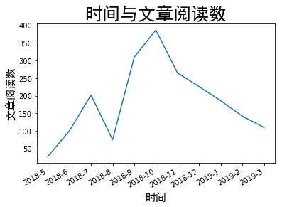

# 本仓库用来存放我看过的认为比较好的文章---根据时间排序
若想看根据分类排序 [good-articlles-by-sort](https://github.com/zhang0peter/good-articles-by-sort)

        

## 2018-10

*   
*   
*   
*   
*   
*   
*   
*   
*   
*   
*   
*   
*   
*   
*   
*   
*   
*   
*   
*   
*   
*   
*   
*   
*   
*   
*   
*   
*   
*   
*   
*   
*   
*   
*   
*   
*   
*   
*   
*   
*   
*   
*   
*   
*   
*   
*   
*   
*   
*   
*   
*   
*   
*   
*   
*   
*   
*   
*   
*   
*   
*   
*   
*   
*   
*   
*   
*   
*   
*   
*   
*   
*   
*   
*   
*   
*   
*   
*   
*   
*   
*   
*   
*   
*   
*   
*   
*   
*   
*   
*   
*   
*   
*   
*   
*   
*   
*   
*   
*   
*   
*   
*   
*   
*   
*   
*   
*   [Learning about Linux Processes](https://linuxgazette.net/133/saha.html)
*   [linux内核 for_each_process报错问题](https://blog.csdn.net/zyf2333/article/details/80042893)
*   [我的朝鲜战争：一个志愿军战俘的自述](https://mp.weixin.qq.com/s?__biz=MjM5NjI1OTc5Mw==&mid=2652171543&idx=1&sn=1d244d112adc643a9424f5c9d58f44f7&chksm=bd0bbfa98a7c36bfc45e20c4370a3d663b41d65556b6a5cbe0fc246f40b2661aaf0ecce24111&mpshare=1&scene=23&srcid=1012Q3Mlc27QGcsPmBFFvoLS#rd)
我们很多人可能都被教育过要把你的想法说出来，领导、老师、组织都会100%理解并客观评价你的，但是我想说这纯属扯淡。凡是让你毫无保留的把内心想法都说出来的人，其目的要么是看你还有多大利用价值；要么是看你会不会搞出事来威胁到他的利益。没有人是真的想去了解你的内心，你也不应该再奢求别人来了解你。
*   [如何编写一个简单的 Linux 内核模块](https://www.oschina.net/translate/writing-a-simple-linux-kernel-module?utm_source=tuicool&utm_medium=referral)
*   [[Windows] 【转】9.2日发布最新赢政天下 Adobe CC 2018 大师版 v8.3 Final](https://www.52pojie.cn/thread-796276-1-1.html)
*   [Potplayer如何截取视频](https://jingyan.baidu.com/article/20b68a885b8f18796cec6293.html)
*   [AE如何剪辑视频与拼接视频](https://jingyan.baidu.com/article/95c9d20d63d81fec4e7561b2.html)
*   [Python多进程编程及多进程间的通信，数据传输](http://www.cnblogs.com/BanL/p/9637033.html?utm_source=tuicool&utm_medium=referral)
*   [python学习第三十三天：守护进程，进程互斥锁，通信，生产者消费者模型](http://www.cnblogs.com/luck-L/p/9299953.html?utm_source=tuicool&utm_medium=referral)
*   [操作系统和 Web 服务器那点事儿](https://mp.weixin.qq.com/s/-rzyDpckS9CUQblAUac0FQ?utm_source=tuicool&utm_medium=referral)
*   [无线老司机侃下一代Wi-Fi技术标准802.11ax](http://www.d1net.com/wl/tech/512256.html?utm_source=tuicool&utm_medium=referral)
*   [**IEEE802.11w无线安全协议剖析**](http://www.freebuf.com/articles/wireless/134349.html?utm_source=tuicool&utm_medium=referral)
*   [[现代操作系统] I/O设备](http://www.jianshu.com/p/7ad00c7b4612?utm_source=tuicool&utm_medium=referral)
*   [Java 10 var关键字详解和示例教程](http://www.infoq.com/cn/articles/java-10-var-type?utm_source=tuicool&utm_medium=referral)
*   [不懂RPC实现原理怎能实现架构梦](http://blog.51cto.com/13676067/2130669?utm_source=tuicool&utm_medium=referral)
*   [升级到Windows 10操作系统后怎么清理c盘中的垃圾？](http://os.51cto.com/art/201808/581331.htm?utm_source=tuicool&utm_medium=referral)
*   [【安卓笔记】进程优先级](http://blog.csdn.net/chdjj/article/details/19293349?utm_source=tuicool&utm_medium=referral)
*   [.NET Core 获取操作系统各种信息](http://www.cnblogs.com/stulzq/p/9070164.html?utm_source=tuicool&utm_medium=referral)
*   [中国芯片和操作系统怎么失败的？当事人是这么说的](http://server.51cto.com/CPU-577562.htm?utm_source=tuicool&utm_medium=referral)
*   [Linux内存逆向映射（reverse mapping）技术的前世今生](http://stor.51cto.com/art/201810/584715.htm?utm_source=tuicool&utm_medium=referral)
*   [**802.11 学习笔记**](http://www.binss.me/blog/notes-of-802.11-protocal/?utm_source=tuicool&utm_medium=referral)
*   [有关802.11的Beacon帧](http://blog.csdn.net/rs_network/article/details/50676786?utm_source=tuicool&utm_medium=referral)
*   [802.11协议精读20：初探802.11e（WMM）](https://zhuanlan.zhihu.com/p/22993136?utm_source=tuicool&utm_medium=referral)
*   [快上车！锐捷老司机深度解析802.11ax 技术](http://net.yesky.com/internet/317/110966817.shtml?utm_source=tuicool&utm_medium=referral)
*   [安全协议系列（三）----CCMP与WPA-PSK - efzju](http://www.cnblogs.com/efzju/p/3247155.html?utm_source=tuicool&utm_medium=referral)
*   [iPad及BT4下的WEP破解实验与分析 | Network Security](http://blog.csdn.net/stone548534/article/details/8836217?utm_source=tuicool&utm_medium=referral)
*   [无线路由器加密方式AES和TKIP的区别](http://www.myhack58.com/Article/sort097/2015/66570.htm?utm_source=tuicool&utm_medium=referral)
*   [WEP算法的安全性](http://www.cnblogs.com/frydsh/p/4507378.html?utm_source=tuicool&utm_medium=referral)
*   [**（六）STA接入过程**](http://www.cnblogs.com/santiaoa/p/5784306.html?utm_source=tuicool&utm_medium=referral)
*   [浅论密钥重装攻击KRACK](https://www.anquanke.com/post/id/152210?utm_source=tuicool&utm_medium=referral)
*   [WPA2 “KRACK”漏洞简介与重现](https://paper.seebug.org/512/?utm_source=tuicool&utm_medium=referral)
*   [普通硬件就能破解GSM A5加密算法](http://www.freebuf.com/news/117897.html?utm_source=tuicool&utm_medium=referral)
*   [IMSI与IMEI 概念](http://cuisuqiang.iteye.com/blog/2067254?utm_source=tuicool&utm_medium=referral)
*   [如何使用BackTrack破解WIFI无线网络的WEP密钥](http://linux.cn/thread/12084/1/1/?utm_source=tuicool&utm_medium=referral)
*   [比较：WEP、WPA和WAPI](http://www.4shell.org/archives/2036.html?utm_source=tuicool&utm_medium=referral)
*   [自学Aruba1.3-WLAN一些基本常识802.11n速率计算方式、802.11n及802.11AC速率表](http://www.cnblogs.com/yaoyaojcy/p/8270331.html?utm_source=tuicool&utm_medium=referral)
*   [我所理解的HTTP协议](http://www.cnblogs.com/cr330326/p/9426018.html?utm_source=tuicool&utm_medium=referral)
*   [去哪儿网络电话VOIP技术解析](http://mobnav.qunar.com/2016/12/27/%E5%8E%BB%E5%93%AA%E5%84%BF%E7%BD%91%E7%BB%9C%E7%94%B5%E8%AF%9DVOIP%E6%8A%80%E6%9C%AF%E8%A7%A3%E6%9E%90/?utm_source=tuicool&utm_medium=referral)
*   [GSM高级网络优化工程师面试总结](http://www.mianwww.com/html/2014/03/20100.html?utm_source=tuicool&utm_medium=referral)
*   [HackRF 入门 -- GPS欺骗、GSM嗅探](http://s1nh.org/post/hackrf-quick-start/?utm_source=tuicool&utm_medium=referral)
*   [[译] 出于性能考虑，请别使用 pip 安装 TensorFlow](https://mp.weixin.qq.com/s/u3_RDIPYVCZrLXmwLz7eRA?utm_source=tuicool&utm_medium=referral)
*   [再谈SS7：电话窃听原理揭秘](http://www.aqniu.com/threat-alert/15581.html?utm_source=tuicool&utm_medium=referral)
*   [脑残式网络编程入门(一)：跟着动画来学TCP三次握手和四次挥手](http://www.52im.net/thread-1729-1-1.html)
*   [脑残式网络编程入门(二)：我们在读写Socket时，究竟在读写什么？](http://www.52im.net/thread-1732-1-1.html)
*   [脑残式网络编程入门(三)：HTTP协议必知必会的一些知识](http://www.52im.net/thread-1751-1-1.html)http://www.52im.net/thread-1751-1-1.html
*   [脑残式网络编程入门(四)：快速理解HTTP/2的服务器推送(Server Push)](http://www.52im.net/thread-1795-1-1.html)
*   [脑残式网络编程入门(五)：每天都在用的Ping命令，它到底是什么？](http://www.52im.net/thread-1973-1-1.html)
*   [CDMA学习](http://www.cnblogs.com/xlw1219/p/3770371.html?utm_source=tuicool&utm_medium=referral)
*   [神器Pytorch（1）](https://mp.weixin.qq.com/s?__biz=MzA5Mzc3MzQ0Nw==&mid=2665585772&idx=1&sn=946b31ca46385c24bbb73f19bda36ea0&chksm=8b4df784bc3a7e92ab0806de6a1b263929e6f06e943935a0c6b50c5cd455fd455d251387520a&scene=21#wechat_redirect)
*   [神器Pytorch（2）](https://mp.weixin.qq.com/s?__biz=MzA5Mzc3MzQ0Nw==&mid=2665585852&idx=1&sn=fe7fdeb2905d5525b97dc1a06c47f42d&chksm=8b4df754bc3a7e42484fcaa74a5d654bf8c6938dcf6da05d1a7405dc0e6c3e67c0622491fa3f&scene=21#wechat_redirect)
*   [Pytorch神器（3）](https://mp.weixin.qq.com/s?__biz=MzA5Mzc3MzQ0Nw==&mid=2665585901&idx=1&sn=fb54f38876ac4820190b728e06d3c0bc&chksm=8b4df705bc3a7e13452b58b17a25b7b650850ae043172152f888be2e28600331a9b16c006a2c&scene=21#wechat_redirect)
*   [Pytorch神器（4）](https://mp.weixin.qq.com/s?__biz=MzA5Mzc3MzQ0Nw==&mid=2665585952&idx=1&sn=11d4867ec7b305eb0d6843083ef69e7d&chksm=8b4df6c8bc3a7fdedfadb1941ae71caa30a42ca6b136339ee32b0bc3db62ee97b9a488b7170e&scene=21#wechat_redirect)
*   [Pytorch神器（5）](https://mp.weixin.qq.com/s?__biz=MzA5Mzc3MzQ0Nw==&mid=2665585983&idx=1&sn=b10d59a785a08a02248b78ccd06eca83&chksm=8b4df6d7bc3a7fc156da7877ea394467f1731c2d98d19cc030bf9b59f98d1233c6856975ed3a&scene=21#wechat_redirect)
*   [Pytorch神器（6）](https://mp.weixin.qq.com/s?__biz=MzA5Mzc3MzQ0Nw==&mid=2665586004&idx=1&sn=de61c130d39b9050996676324decaf45&chksm=8b4df6bcbc3a7faac4fe00724d9dfc38edcb90bdbbf24e49032b4d40bdf3fa4e9b5349287827&scene=21#wechat_redirect)
*   [Pytorch神器（7）](https://mp.weixin.qq.com/s?__biz=MzA5Mzc3MzQ0Nw==&mid=2665586028&idx=1&sn=23c930128ddf8435e76e961498fa79f7&chksm=8b4df684bc3a7f92f580b0900517932aea12431095e2bd1e2a31de0d85d9cb79bd6c2f13138c&mpshare=1&scene=23&srcid=0505ge0oCG47QR5fPkoitZNF#rd)
*   [精心整理｜公众号文章目录大全](https://mp.weixin.qq.com/s?__biz=MzI0MDQ4MTM5NQ==&mid=2247486761&idx=1&sn=113b7ed3862ae0f24fb392a5137446dc&chksm=e91b6835de6ce1232559a0e84d8149a1dbd7f425363ec8c1b3bbd38e9e32ca516a088f73c704&mpshare=1&scene=23&srcid=0920UkLZnYLM8uQs7xyxPHio#rd)
*   [【官方双语】形象展示傅里叶变换](https://www.bilibili.com/video/av19141078?share_medium=android&share_source=qq&bbid=6CC6D1F3-777B-41F3-9B30-B50818008D5D140271infoc&ts=1538020301369)
*   [精心整理 | 2018年三、四月技术文章目录](https://mp.weixin.qq.com/s?__biz=MzIwNTc4NTEwOQ==&mid=2247485270&idx=1&sn=fde2ae57dafefaad0edc5e50ae748e95&chksm=972ad62ca05d5f3a9c23ce4912fdd0e6064a3d6852271088e9c5079c52d79d1f43d7e8570504&scene=0&ascene=7&devicetype=android-26&version=26060240&nettype=cmnet&abtest_cookie=BAABAAoACwAMAA0ACAA%2Bix4Ad4seAJaMHgDOjh4AII8eAEiPHgBUjx4AX48eAAAA&lang=zh_CN&pass_ticket=Icq0LZV%2B%2B4VJcBicMdA6OdM%2FD8IamFAxsivQB2pGktjZPw4DHZDxzF4I1pgxjL3y&wx_header=1)
*   [【系统编程】你所不知道的TIME_WAIT（下](https://mp.weixin.qq.com/s?__biz=MzIwNTc4NTEwOQ==&mid=2247485070&idx=1&sn=f6c3d063ac45e019d043b06d2b404404&scene=21#wechat_redirect)
*   [【系统编程】你所不知道的TIME_WAIT和CLOSE_WAIT（上）](https://mp.weixin.qq.com/s?__biz=MzIwNTc4NTEwOQ==&mid=2247485038&idx=2&sn=276bc4b907af12a0b1cfad75177830fb&scene=21#wechat_redirect)
*   [Git 原理入门](http://www.ruanyifeng.com/blog/2018/10/git-internals.html)
*   [用50行Python代码解决cart pole平衡问题](https://zhuanlan.zhihu.com/p/45543495?utm_source=tuicool&utm_medium=referral)
*   [十位安卓开发者的 17 年总结](https://blog.csdn.net/D29h1jQy3akVx/article/details/78950096?utm_source=tuicool&utm_medium=referral)
*   [我是如何学习安卓开发的](https://mp.weixin.qq.com/s/fkNRpubQMxaxVaycA4hNLw?utm_source=tuicool&utm_medium=referral)
*   [iOS开发者一步一步入门安卓（二）](https://www.jianshu.com/p/342191da2a33)
*   [Android Studio 和 SDK 下载、安装和环境变量配置](https://blog.csdn.net/siwuxie095/article/details/53431818)
*   [【Android】解决Android Studio 中SDK manager无法更新的问题](https://blog.csdn.net/lchad/article/details/42110647)
*   [Java怎么实现输入一个string表达式然后输出计算的结果](https://zhidao.baidu.com/question/144563176.html)
*   [Java计算表达式的值](https://www.jianshu.com/p/682e8e8d3dfb)
*   [压栈思想计算Java运算表达式](http://elim.iteye.com/blog/1981197)
*   [操作系统中长期调度、中期调度和短期调度之间的区别](https://blog.csdn.net/u013007900/article/details/50550415)
*   [历史技术文章分类目录（数据结构与算法部分](https://mp.weixin.qq.com/s?__biz=MzIwNTc4NTEwOQ==&mid=2247485648&idx=1&sn=37e2554f83576362d16d1e98d987209c&chksm=972ad9aaa05d50bc20af87015077d91537cdb9a2b403f06ed76d31348a1d72c3e52fdca2aaa9&mpshare=1&scene=23&srcid=0927L5lzgqZ2jhaUPh4qbwMC#rd)
*   [RFID 破解基础详解](https://mp.weixin.qq.com/s?__biz=MzI5MDQ2NjExOQ==&mid=2247488354&idx=1&sn=be1205869e1be6bf5df3b3f2132d2969&chksm=ec1e234adb69aa5c7ad878b5ffbaf974c0ab17c8d892d532adf529585b6c2dd27b6d1b09c1ab&mpshare=1&scene=23&srcid=1007cOXOj6yKfhMWWXPz1d6X#rd)
*   [图形学 光栅化详解（Rasterization）](https://www.jianshu.com/p/54fe91a946e2?utm_source=tuicool&utm_medium=referral)
*   [HTML5 Canvas 提高班（一） —— 光栅图形学（1）中点画圆算法](http://www.cnblogs.com/doudougou/archive/2012/04/26/2472048.html?utm_source=tuicool&utm_medium=referral)
*   [AST抽象语法树](http://web.jobbole.com/95171/?utm_source=tuicool&utm_medium=referral)
*   [[译]用javascript实现一门编程语言-AST的介绍](https://juejin.im/post/5b6e86546fb9a04f9a5d066f?utm_source=tuicool&utm_medium=referral)
*   [汇编层面分析函数调用](https://mp.weixin.qq.com/s/mjST0sNs3mo9KaMeLXaTMA?utm_source=tuicool&utm_medium=referral)
*   [前端安全系列（一）：如何防止XSS攻击？](http://www.freebuf.com/articles/web/185654.html?utm_source=tuicool&utm_medium=referral)
*   [搞懂SVG/Canvas中nonzero和evenodd填充规则](https://www.zhangxinxu.com/wordpress/2018/10/nonzero-evenodd-fill-mode-rule/)
*   [国人休假的风雨变迁](https://www.huxiu.com/article/265343.html?utm_source=tuicool&utm_medium=referral)
*   [如何使用 Spring Boot 开发邮件系统？](https://mp.weixin.qq.com/s?__biz=MzI4NDY5Mjc1Mg==&mid=2247485899&idx=1&sn=d845e354e106cb0b3893951c363a1a9a&chksm=ebf6d1b4dc8158a25ea1cbaaf8c707c6818bbdcfcb7ba917af0c8afca7c97c486960267b7a3c&mpshare=1&scene=23&srcid=1009Ue7Tgkg9lT5QenoWdiWH#rd)
*   [谈谈签证这点事](https://mp.weixin.qq.com/s?__biz=MzI0MjA1Mjg2Ng==&mid=2649867586&idx=1&sn=b161af86367a07b3cfd9a032f4811d7e&chksm=f1075f2fc670d639aed9a6b1973e63346425c2b6900266760f94dfa2b7b0ada529536e78c539&mpshare=1&scene=23&srcid=10096YUII8QRhbGBF74quGYU#rd)
*   [TCP没那么难吧【续】](https://mp.weixin.qq.com/s?__biz=MzA3MDMwOTcwMg==&mid=2650005835&idx=1&sn=dd0104635b5510ab6bf4f34ec347fe57&chksm=87398362b04e0a7402a6075b46e9a62855a78408a6dfecf6f7d13d8ae5e0375fab6d84208159&mpshare=1&scene=23&srcid=1009dADinFPQr0TnVigP7vj7#rd)
*   [前端黑魔法之远程控制地址栏](https://mp.weixin.qq.com/s?__biz=MjM5NjA0NjgyMA==&mid=2651068106&idx=1&sn=77468b7fd5b6f495909b8ed833053a22&chksm=bd1f84418a680d5756a5bdb8e62f4912fab837ce67fea7acf23a07dcdbd19ba6919f0c4db9fd&mpshare=1&scene=23&srcid=1009rxVuqGE8x8t3sTJgKebT#rd)
*   [x509 Certificate Manual Signature Verification](https://linuxctl.com/2017/02/x509-certificate-manual-signature-verification/)
*   [架构师之路17年精选80篇](https://mp.weixin.qq.com/s?__biz=MjM5ODYxMDA5OQ==&mid=2651960945&idx=1&sn=d08f33c5f317fee8956252da8e0236b6&chksm=bd2d03ad8a5a8abb0370b826b7384a4095a5ed36238f0911d102b0ceee8e5d2fbe3bc80c56d9&mpshare=1&scene=23&srcid=0925RWzAWeKEakFEvHBKltjE#rd)
*   [The Smallest Bash Script in the Universe](https://blog.twentytwotabs.com/the-smallest-bash-program-in-the-universe/)
*   [前端安全系列（一）：如何防止XSS攻击？](https://tech.meituan.com/fe_security.html?utm_source=tuicool&utm_medium=referral)
*   [关于 fuzz 的一些思考](https://github.com/tinysec/public/blob/master/article/about_fuzz/about_fuzz_cn.md?utm_source=tuicool&utm_medium=referral)
*   [linux下fuzz初试](http://edvison.cn/2018/09/08/linux%E4%B8%8Bfuzz%E5%88%9D%E8%AF%95/?utm_source=tuicool&utm_medium=referral)
*   [MD5哈希注入的两种方式](https://bbs.ichunqiu.com/thread-46567-1-1.html)
*   [大话 JavaScript 动画](https://fanmingfei.com/posts/Animation_Base.html?utm_source=tuicool&utm_medium=referral)
*   [如何使用变分自编码器VAE生成动漫人物形象](https://www.jiqizhixin.com/articles/generate-anime-character-with-VAE?utm_source=tuicool&utm_medium=referral)
*   [JS 继承的从入门到理解](https://mp.weixin.qq.com/s?__biz=MzU0OTExNzYwNg==&mid=2247484392&idx=1&sn=98c987fefeee199035270663e5e6fc79&chksm=fbb58821ccc20137403540702cda63d6cf8ed6fbddb00afd8b92358c52215faae6ce01c67a9c&token=1831638337&lang=zh_CN&rd2werd=1&utm_source=tuicool&utm_medium=referral)
*   [一个故事读懂Java泛型](https://mp.weixin.qq.com/s?__biz=MzU1MDE4MzUxNA==&mid=2247484522&idx=1&sn=1f95b28d646fbae28d365e9e95cf12df&chksm=fba5335fccd2ba49bc6a8f468b77473398955c0d65e86abf416a4d745c0ff61e81e736c9275f&mpshare=1&scene=23&srcid=1004pd8QaYYz9OatXbits3Sb#rd)
*   [【面试现场】如何在500w个单词中统计特定前缀的单词有多少个？](https://mp.weixin.qq.com/s?__biz=MzIzMTE1ODkyNQ==&mid=2649410317&idx=1&sn=6a142afbee6e8ead78dbe145e4f56b8a&chksm=f0b60eefc7c187f9f1aa7008b5fc24a48700af5fec2a37a2ba98b14838b4ce58f260fc937053&mpshare=1&scene=23&srcid=1006uzLysKJVdrRfT7tsvHwo#rd)
*   [一文读懂Java泛型中的通配符 ？](https://mp.weixin.qq.com/s?__biz=MzU1MDE4MzUxNA==&mid=2247484493&idx=1&sn=a855fd4f875ef2b01f84b72b49df6700&chksm=fba53378ccd2ba6eb46e67ca12b9edc3ef0d0df65c59be5a6ad94fa4f9d62a9457dc075c0c88&mpshare=1&scene=23&srcid=1004QSdMFphm0ObJ6Uorlh9P#rd)
*   [老司机带你过常规WAF](https://mp.weixin.qq.com/s?__biz=MzIzMTc1MjExOQ==&mid=2247484805&idx=1&sn=342154eb6d029a120fda90f774e26cae&chksm=e89e2d5ddfe9a44b9e7572f2840460de3ecdf3b71801ecca67ba89f3584fbddb87b64f61e81d&mpshare=1&scene=23&srcid=0927M1vDsgB9KnEofPRftv41#rd)
*   [新手指南：Bwapp之XSS –stored](https://mp.weixin.qq.com/s?__biz=MzI5MDQ2NjExOQ==&mid=2247486246&idx=1&sn=777ed12d510260ea46e991e3ac1cf62e&chksm=ec1e3b0edb69b218e0198767d40af400f65a909cabd32fa01604ed6fd3a50bfbffa8f7502e6b&mpshare=1&scene=23&srcid=0928XoVICNeCSi5AduwxlDdc#rd)
*   [RSA Public-Key Encryption and Signature Lab](http://www.cis.syr.edu/~wedu/seed/Labs_16.04/Crypto/Crypto_RSA/Crypto_RSA.pdf)
*   [深入理解Java枚举类型(enum)](https://blog.csdn.net/javazejian/article/details/71333103)
*   [Openssl中的BIGNUM运算函数(整理)](https://blog.csdn.net/jnxxhzz/article/details/81235981)
*   [16行Python实现3D破坏球效果](https://mp.weixin.qq.com/s?__biz=MzA3OTgyMDcwNg==&mid=2650635965&idx=2&sn=98ce89a7ddb9601073276db2df86a929&chksm=87a47c70b0d3f5667856b27c480c2fccb0542857bfd28a463e188b3de36b93feb13f73a7c2aa&mpshare=1&scene=23&srcid=1005kMLDzC3rhGpPdEssonSJ#rd)
*   [RSA Public-Key Encryption and Signature Verification Using Linux](http://deepakharin.blogspot.com/2018/03/private-key-generation.html)
*   [使用 Ptrace 去拦截和仿真 Linux 系统调用](https://linux.cn/article-9942-1.html?utm_source=tuicool&utm_medium=referral)
*   [Playing with ptrace, Part I](https://www.linuxjournal.com/article/6100)
*   [ptrace的PTRACE_POKETEXT参数](https://blog.csdn.net/u011580175/article/details/82768250)
*   [The ptrace system call Building a strace-like program using ptrace on a x86_64 architecture.](https://groogroot.eu/the-ptrace-system-call/)
*   [Linux源码分析之Ptrace](https://blog.csdn.net/u012417380/article/details/60468697)
*   [ptrace系统调用](https://blog.csdn.net/littlegrizzly/article/details/7552912?utm_source=tuicool&utm_medium=referral)
*   [system call tracing using ptrace](https://stackoverflow.com/questions/9769350/system-call-tracing-using-ptrace)
*   [LINUX SYSTEM CALL TABLE FOR X86 64](http://blog.rchapman.org/posts/Linux_System_Call_Table_for_x86_64/)
*   [bresenham直线，画圆算法（附OpenGL代码）](https://blog.csdn.net/mayh554024289/article/details/44781531?utm_source=tuicool&utm_medium=referral)
*   [2018-10-4 深入探讨范冰冰事件：资本积累与税收调控](https://mp.weixin.qq.com/s?__biz=MjM5NzE2NTY0Ng==&mid=2650674418&idx=1&sn=f3ebbd13556cde52ff3862504664a304&chksm=bed49bd389a312c5361113238522061f3be77a31fb8e4aa41b839858d4f7d3f09d550813daf1&mpshare=1&scene=23&srcid=1005Qs3wmWRnqxqPfAxbFtmv#rd)
*   [游戏中DDA算法和Bresenham算法的应用](https://blog.csdn.net/pbymw8iwm/article/details/41823717?utm_source=tuicool&utm_medium=referral)
*   [学习OpenGL（五）绘制多边形](https://blog.csdn.net/th_gsb/article/details/51140842)
*   [**如何在CTF中少走弯路（基础篇）**](https://mp.weixin.qq.com/s?__biz=MjM5NjA0NjgyMA==&mid=2651068636&idx=3&sn=11802b910f3ef2fa2b3cd64cf566c72c&chksm=bd1f8a578a6803414f68677f4d1bfbb290844852904adf7ea1b210d7a9a856ecde0845d6b75b&mpshare=1&scene=23&srcid=0927t1l6Q52MxvXEnXPzjDj8#rd)
*   [RESTful API 最佳实践](http://www.ruanyifeng.com/blog/2018/10/restful-api-best-practices.html)
*   [初学者应该掌握的七种回归分析方法](https://mp.weixin.qq.com/s?__biz=MzIzNzA4NDk3Nw==&mid=2457735795&idx=1&sn=f8ce9e5a1b34f6f6edb7d27fab1fefbe&chksm=ff44ba2dc833333b6fc5111d7f186a936b6bc3e25c9ddddc4a3ea5240c10deba7f7e8a368227&scene=0&ascene=14&devicetype=android-26&version=26060240&nettype=cmnet&abtest_cookie=BAABAAoACwAMAA0ADQCcih4An4oeAD6LHgBIix4AdoseAJaMHgCpjB4A4oweACqNHgBijR4AZ40eAImNHgCyjR4AAAA%3D&lang=zh_CN&pass_ticket=iFF1tyzYfxyXaD%2BwFfhwFfC3HEHZp7zohKBghrGob7%2FY9mgf%2BLCT6Nw7gjzoUeSD&wx_header=1)
*   [2018-10-1 斯堪的纳维亚的社会主义空气](https://mp.weixin.qq.com/s?__biz=MjM5NzE2NTY0Ng==&mid=2650674409&idx=1&sn=2347051ff16c95b57cdcdcdb8cd5f106&chksm=bed49bc889a312deef28af5605a30fe275acf963db5fe8e248875f094367bea67e2bc1522ab9&mpshare=1&scene=23&srcid=1002RunvXJazPEaoInah9eXZ#rd)
*   [浅谈PHP安全规范](http://www.freebuf.com/articles/web/184567.html?utm_source=tuicool&utm_medium=referral)
*   [Java 干货之深入理解String](http://www.cnblogs.com/dengchengchao/p/9713859.html?utm_source=tuicool&utm_medium=referral)
*   [关于带副作用的表达式的一点笔记](http://rednaxelafx.iteye.com/blog/132187)
*   [What is x after “x = x++”?](https://stackoverflow.com/questions/7911776/what-is-x-after-x-x)
*   [【基础算法】最易懂的 Alpha-Beta 剪枝算法详解](https://mp.weixin.qq.com/s?__biz=MzI4MDYzNzg4Mw==&mid=2247487164&idx=1&sn=aa03a2a9c5687ea26136566490c7f30f&chksm=ebb43668dcc3bf7e867153a5c6c42a2da056eb8feba2172d74e12e3fff64d1f416a933f0a009&scene=0&ascene=14&devicetype=android-26&version=26060739&nettype=cmnet&abtest_cookie=AwABAAoACwAMAAYAPoseACWXHgAKmB4ANpgeAHeYHgChmB4AAAA%3D&lang=zh_CN&pass_ticket=tqg0vPML%2BTARLJOLY%2Ftw59g6C1%2Bf20Y782OQrJaIhR2lXQpvSa3mHgK6ggoIP0Ak&wx_header=1)
*   [如何养成好习惯？秘密全都在这里](https://mp.weixin.qq.com/s?__biz=MzAxNTY0NjEzNg==&mid=2247484788&idx=1&sn=29abdd37d15351a8174771ba21f3c747&chksm=9b81a9a3acf620b5b0815ffca946d3da58a68b1306c4e1f066c65c2905bbd559c5a3a6b4b55b&scene=0&ascene=7&devicetype=android-26&version=26060240&nettype=WIFI&abtest_cookie=BAABAAoACwAMAA0ABQA%2Bix4Ad4seAJaMHgBijR4Azo4eAAAA&lang=zh_CN&pass_ticket=20fNkNM6n523QRgxA%2F7cS21IEVww5gHeqdFdeKgiiVI5C6hlVFKvYH0wJk7Cr7UT&wx_header=1)
*   [漫画解读：通过造汽车了解软件开发模式 ​​​](https://mp.weixin.qq.com/s?__biz=MjM5OTA1MDUyMA==&mid=2655440332&idx=1&sn=f818cb08a03666f3196b4a6477a082cd&chksm=bd7301bb8a0488ad47fdea72a1836e094984a705234b8ed428885f6aed4049f0756d484f985b&mpshare=1&scene=24&srcid=0807MYmb7v6OuszBk3auWf4k&ascene=14&devicetype=android-26&version=26060739&nettype=cmnet&abtest_cookie=AgABAAoACwACACWXHgA%2FmR4AAAA%3D&lang=zh_CN&pass_ticket=Elv7iatAhn%2B6OFyZ8fmKMnfL7oMPzeqs4mggRCYbmUOfzx0eiRpulaORq%2B%2BYC%2BDl&wx_header=1)
*   [17个案例带你3分钟搞定Linux正则表达式](https://mp.weixin.qq.com/s?__biz=MzI4MDEwNzAzNg==&mid=2649445080&idx=1&sn=16355547d16aadfe6e0856e6918e8056&chksm=f3a273abc4d5fabde136d578ca41990f4c99d83f9b7d3788f01178fd384a4fc5a729b2097c45&mpshare=1&scene=23&srcid=09287O5TcbuBAYdDKng1UP33#rd)
*   [拜托，面试别再让我数1了！！！](https://mp.weixin.qq.com/s?__biz=MjM5ODYxMDA5OQ==&mid=2651961600&idx=1&sn=d006b5ac6c5e1fda0f0a1903d7f6bf8b&chksm=bd2d0cdc8a5a85ca03423bd311081ce1c25b1538ae0b0769b25a2ba9a89184b4950cced2734c&mpshare=1&scene=23&srcid=0927ZR5tXAhW6x6zjREscSdM#rd)
*   [深入理解Java中的i++、++i语句](https://blog.csdn.net/xialei199023/article/details/76383013)
*   [【底层原理】深入理解Cache （下）](https://mp.weixin.qq.com/s?__biz=MzIwNTc4NTEwOQ==&mid=2247485970&idx=1&sn=776c00ebe3a198381ccf1f0369324144&chksm=972adb68a05d527e8fe800ece2e87e692f49de73e38adcc80b5cad94f1eb1aae132b4d45b0c7&mpshare=1&scene=23&srcid=09280ACGH3XeA6NTQvxCZErU#rd)
*   [【协议森林】通信协议之序列化](https://mp.weixin.qq.com/s?__biz=MzIwNTc4NTEwOQ==&mid=2247485688&idx=1&sn=46748e988ba0650c9125ea54474d1eeb&chksm=972ad982a05d5094d3ee3642153c6712f1ec3ddc6855734df5d4e3a1a1006a301cdc2cfe4dab&mpshare=1&scene=23&srcid=0926vDAn0AkK6UEG3YrVf6su#rd)
*   [如何实现可以获取最小值的栈？](https://mp.weixin.qq.com/s?__biz=MzAxOTc0NzExNg==&mid=2665515094&idx=1&sn=ba40ca025c1bd41d42959f43066edc49&chksm=80d67015b7a1f90334dbf86ad20b2ea270a83d19d53afb3f56b899d0ba7c3bc5a2b8d2685ac2&mpshare=1&scene=23&srcid=09282JOTrND6MwTgVKXCMzTI#rd)
*   [深入浅出cache写策略](https://mp.weixin.qq.com/s?__biz=MzAwMDM4NTUyNw==&mid=2652241467&idx=1&sn=97ff1f88fe2e70d15edba780f385b7c4&chksm=810896a3b67f1fb57c42af95d3a10c5a39e508486556d10d161a20731ec464e4391012a3c9c7&mpshare=1&scene=23&srcid=0808dYzfxywz2OtXsFgpzv6l#rd)
*   [什么是可计算理论](https://blog.csdn.net/zyearn/article/details/9196797?utm_source=tuicool&utm_medium=referral)
*   [传输层安全协议SSL/TLS的Java平台实现简介和Demo演示](http://www.52im.net/thread-327-1-1.html)
*   [编译原理](http://ljchen.net/2018/09/02/%E7%BC%96%E8%AF%91%E5%8E%9F%E7%90%86/?utm_source=tuicool&utm_medium=referral)
*   [微信团队原创分享：Android版微信后台保活实战分享(网络保活篇)](http://www.52im.net/thread-209-1-1.html)
*   [微信团队原创分享：Android版微信后台保活实战分享(进程保活篇)](http://www.52im.net/thread-210-1-1.html)
*   [P2P技术详解(三)：P2P技术之STUN、TURN、ICE详解](http://www.52im.net/thread-557-1-1.html)
*   [P2P技术详解(二)：P2P中的NAT穿越(打洞)方案详解](http://www.52im.net/thread-542-1-1.html)
*   [P2P技术详解(一)：NAT详解——详细原理、P2P简介](http://www.52im.net/thread-50-1-1.html)
*   [无法预测的根源——随机数](http://halfrost.com/random_number/?utm_source=tuicool&utm_medium=referral)
*   [［从0到1编写服务器］TCP连接建立与断开状态变化](http://www.hoohack.me/2018/09/27/webser-zero-to-hero-tcp-status?utm_source=tuicool&utm_medium=referral)
*   [新手入门贴：史上最全Web端即时通讯技术原理详解](http://www.52im.net/thread-338-1-1.html)
*   [2018-2-3 为什么当今的流行文化那么热衷于好人与坏人间的斗争？](http://www.qdaily.com/articles/49839.html?share_from=app)
*   [2018-3-18 为什么人们会信仰暴君？](http://www.qdaily.com/articles/51136.html?share_from=app)
*   [2018-1-27 谈及市场经济，真实的亚当·斯密究竟想要告诉我们什么？](http://www.qdaily.com/articles/49608.html?share_from=app)
*   [为什么QQ用的是UDP协议而不是TCP协议？](http://www.52im.net/thread-279-1-1.html)
*   [3分钟看懂linux磁盘划分](https://mp.weixin.qq.com/s?__biz=MzI4MDEwNzAzNg==&mid=2649444877&idx=1&sn=62bb9e5612da34dfacb943f0ce6af9bb&chksm=f3a2737ec4d5fa6805a5d2d748c0b906a4c2707dc72361fb9cc4677e88cad7f246d6fbb61f8b&scene=0&ascene=14&devicetype=android-26&version=26060739&nettype=cmnet&abtest_cookie=AwABAAoACwAMAAYAPoseACWXHgAKmB4ANpgeAHeYHgChmB4AAAA%3D&lang=zh_CN&pass_ticket=tqg0vPML%2BTARLJOLY%2Ftw59g6C1%2Bf20Y782OQrJaIhR2lXQpvSa3mHgK6ggoIP0Ak&wx_header=1)
*   [2018-1-18 100 本书，20 个国家的故事，十几个学者，帮我们了解国家的转型：伊朗篇](http://www.qdaily.com/cards/49330.html?share_from=app)
*   [2017-11-28 “人文关怀”，和皮村多出来的 96 小时 | 二零一七故事⑥](http://www.qdaily.com/articles/47670.html?share_from=app)
*   [**2017-11-21 连 78 岁的钱理群都在谈人工智能了，好在他认为“机器人替代不了鲁迅”**](http://www.qdaily.com/articles/47394.html?share_from=app)
*   [天天在讲的 NoSQL 数据库到底是个什么鬼？](https://mp.weixin.qq.com/s?__biz=MzI0MDQ4MTM5NQ==&mid=2247487140&idx=1&sn=04e37069426e06ca158a8ad1e741e8a0&chksm=e91b6bb8de6ce2ae251e47ad33584246130002fe103a055854e1d8081a8e06c5e93510228407&mpshare=1&scene=23&srcid=0930kA8mHcBb1gYUYVun0DWl#rd)
*   [2017-6-23 做一个中国互联网公司，你要了解的更多关于牌照的事](http://www.qdaily.com/cards/36168.html?share_from=app)
*   [Linux Debugging（七）: 使用反汇编理解函数调用方式GOT/PLT](http://blog.csdn.net/anzhsoft/article/details/18776111?utm_source=tuicool&utm_medium=referral)
*   [深入了解GOT,PLT和动态链接](http://www.cnblogs.com/pannengzhi/p/2018-04-09-about-got-plt.html?utm_source=tuicool&utm_medium=referral)
*   [Linux GOT与PLT](http://www.programlife.net/linux-got-plt.html?utm_source=tuicool&utm_medium=referral)
*   [Operating Systems: Three Easy Pieces](http://pages.cs.wisc.edu/~remzi/OSTEP/)
*   [通过GDB调试理解GOT/PLT](http://rickgray.me/2015/08/07/use-gdb-to-study-got-and-plt.html?utm_source=tuicool&utm_medium=referral)
*   [堆栈基础2-GOT和PLT表](http://www.blogsir.com.cn/safe/638.html?utm_source=tuicool&utm_medium=referral)
*   [聊聊Linux动态链接中的PLT和GOT（１）——何谓PLT与GOT](https://blog.csdn.net/linyt/article/details/51635768)
*   [Linux中的GOT和PLT到底是个啥？](http://www.freebuf.com/articles/system/135685.html)
*   [线程、对称多处理和微内核（OS 笔记三）](http://www.cnblogs.com/backwords/p/9308536.html?utm_source=tuicool&utm_medium=referral)
*   [提高大脑掌控力，这几个方法能帮到你 Lachel  L先生说](https://mp.weixin.qq.com/s?__biz=MzAxNTY0NjEzNg==&mid=2247484833&idx=1&sn=5f769b50d168c0961ef95a3d04b974c0&chksm=9b81a976acf620607a5a06ff681bb958488383e266c374426f6d49ce9483e6155381010128a6&scene=0&ascene=14&devicetype=android-26&version=26060739&nettype=cmnet&abtest_cookie=AwABAAoACwAMAAYAPoseACWXHgAKmB4ANpgeAHeYHgChmB4AAAA%3D&lang=zh_CN&pass_ticket=tqg0vPML%2BTARLJOLY%2Ftw59g6C1%2Bf20Y782OQrJaIhR2lXQpvSa3mHgK6ggoIP0Ak&wx_header=1)
*   [C++中的Digraphs、Trigraphs和Tokens](https://lrita.github.io/2018/09/29/digraphs-trigraphs-and-tokens-in-cpp/)
*   [即时通讯安全篇（一）：正确地理解和使用Android端加密算法](http://www.52im.net/thread-216-1-1.html)
*   [即时通讯安全篇（二）：探讨组合加密算法在IM中的应用](http://www.52im.net/thread-217-1-1.html)
*   [即时通讯安全篇（三）：常用加解密算法与通讯安全讲解](http://www.52im.net/thread-219-1-1.html)
*   [即时通讯安全篇（四）：实例分析Android中密钥硬编码的风险](http://www.52im.net/thread-312-1-1.html)
*   [即时通讯安全篇（五）：对称加密技术在Android平台上的应用实践](http://www.52im.net/thread-642-1-1.html)
*   [即时通讯安全篇（六）：非对称加密技术的原理与应用实践](http://www.52im.net/thread-653-1-1.html)
*   [即时通讯安全篇（七）：如果这样来理解HTTPS，一篇就够了](http://www.52im.net/thread-1890-1-1.html)
*   [分享几个不外传的写作技巧  Lachel  L先生说](https://mp.weixin.qq.com/s?__biz=MzAxNTY0NjEzNg==&mid=2247485020&idx=1&sn=b03e9a213456909f784ad653a9f45f5c&chksm=9b81aa8bacf6239d0ba78fa2ef227e7bc1b447fc97d65ab71be77e87289d4ff045aca516e289&mpshare=1&scene=23&srcid=0927E7iqhjyxZ5aJu0TeeMYN#rd)
*   [Android端消息推送总结：实现原理、心跳保活、遇到的问题等](http://www.52im.net/thread-341-1-1.html)
*   [为什么说基于TCP的移动端IM仍然需要心跳保活？](http://www.52im.net/thread-281-1-1.html)
*   [破解Zip加密文件常用的几种方法](https://www.cnblogs.com/ECJTUACM-873284962/p/9387711.html)
*   [计算理论导引 - 推酷](https://yuyang0.github.io/notes/Theory-Computation.html?utm_source=tuicool&utm_medium=referral)
*   [别让「知道的幻觉」，毁了你的学习和成长  Lachel  L先生说](https://mp.weixin.qq.com/s?__biz=MzAxNTY0NjEzNg==&mid=2247485026&idx=1&sn=6bc61f5af385535ec4ae3b8d10d492cc&chksm=9b81aab5acf623a36e468ed2b5343252c15a60686d395b5724fb2152acdce1d6dae1bd24d7e9&mpshare=1&scene=23&srcid=0928YmDuk9HRW2n0kv3qNTgB#rd)
*   [一文说尽 MySQL 优化原理](https://mp.weixin.qq.com/s?__biz=MzA3OTgyMDcwNg==&mid=2650635223&idx=1&sn=c5ea370559754bd86a1b7e09ed80a944&chksm=87a4791ab0d3f00c6e428d4f324ff363a898bcddd0672ffcb695917da7223ede04da717cf758&mpshare=1&scene=23&srcid=0521Zi3FZET8gGNRyk3io4i3#rd)
*   [实现WebRTC P2P连接](https://www.yinchengli.com/2018/09/27/webrtc/?utm_source=tuicool&utm_medium=referral)
*   [如何在Linux上使用tcpdump命令捕获和分析数据包 - 推酷](http://os.51cto.com/art/201809/584122.htm?utm_source=tuicool&utm_medium=referral)
*   [【协议森林】聊一聊那些常见的网络通信的性能指标](https://mp.weixin.qq.com/s?__biz=MzIwNTc4NTEwOQ==&mid=2247485130&idx=1&sn=23cf19a8667228071ea0ac415f0afcce&chksm=972ad7b0a05d5ea69597c42024f9ca2d611448ccead59c8a05e98ef5245ef11004b80b39e534&mpshare=1&scene=23&srcid=0927ZxFCXIewTfbWUaFVxV2l#rd)
*   [高性能网络编程(六)：一文读懂高性能网络编程中的线程模型](http://www.52im.net/thread-1939-1-1.html)
*   [高性能网络编程(五)：一文读懂高性能网络编程中的I/O模型](http://www.52im.net/thread-1935-1-1.html)
*   [高性能网络编程(四)：从C10K到C10M高性能网络应用的理论探索](http://www.52im.net/thread-578-1-1.html)
*   [高性能网络编程(三)：下一个10年，是时候考虑C10M并发问题了](http://www.52im.net/thread-568-1-1.html)
*   [高性能网络编程(二)：上一个10年，著名的C10K并发连接问题](http://www.52im.net/thread-566-1-1.html)
*   [高性能网络编程(一)：单台服务器并发TCP连接数到底可以有多少](http://www.52im.net/thread-561-1-1.html)
*   [即时通讯安全篇（一）：正确地理解和使用Android端加密算法](http://www.52im.net/thread-216-1-1.html)
*   [通信交换的百年沧桑](https://mp.weixin.qq.com/s/4vGVg1_LP8HQJbC5fMthBw)
*   [为什么每天这么多负面新闻，我的同情心都快被耗尽了 | 深度](https://mp.weixin.qq.com/s?__biz=MTg1MjI3MzY2MQ==&mid=2651700688&idx=1&sn=2bac5b93eb00b3a149c91d27e83e1166&chksm=5da199426ad610543889cd5cbbb0f5ff0f95c66bc28ebcf39ada0db29e10697f61ef7fb77ea3&mpshare=1&scene=23&srcid=0929QGEcF8Bi5B40OElDA5UG#rd)
*   [AdGuard Security Notice](https://adguard.com/en/blog/adguard-security-notice/?aid=18928&utm_source=newsletter&utm_medium=email&utm_campaign=newsletter_september2018) 524词
*   [2018-9-28 学者许子东：为什么 100 年了，鲁迅讲的话就像今天说的一样？（上）](http://www.qdaily.com/articles/55720.html?share_from=app)

## 2018-9 共310篇

*   [浅谈Python Django框架](https://mp.weixin.qq.com/s?__biz=MzA3OTgyMDcwNg==&mid=2650635730&idx=2&sn=ffbb4467ecffff3b23bf23734131e714&chksm=87a47f1fb0d3f60964b4e9f0e53ef21909324bb8355a83a0998d193e46076df93d436cf3f7b1&mpshare=1&scene=23&srcid=0927rUAfKAATLgWPiY131yx0#rd)
*   [SQL和NoSQL注入浅析（下）](https://mp.weixin.qq.com/s?__biz=MzI1NDg4MTIxMw==&mid=2247483817&idx=1&sn=6f8632985698245802706e9109e3e6b5&chksm=ea3f3d7bdd48b46d16e6d1446042ddb8776c2f181432e4d182db81582fcd854bc82020c2af12&mpshare=1&scene=23&srcid=09270lSVyrGFZqeoaXFVfgI3#rd)
*   [2018-9-28 如何看待西航动力研究所张小平离职一事？](https://www.zhihu.com/question/295927388/answer/499385798)
*   [SQL和NoSQL注入原理剖析（上）](https://mp.weixin.qq.com/s?__biz=MzI1NDg4MTIxMw==&mid=2247483732&idx=1&sn=2298cbad2a3f2ed2bd95b7dfc08f256f&scene=21#wechat_redirect)
*   [关于 Linux 编译优化几个必须掌握的姿势](https://mp.weixin.qq.com/s/CIYzI6SAWcHWTD6z3PvOuQ?utm_source=tuicool&utm_medium=referral)
*   [扒一扒随机数（Random Number）的诞生历史](https://segmentfault.com/a/1190000008765669?utm_source=tuicool&utm_medium=referral)
*   [从拥挤的兔子到伪随机数算法](https://juejin.im/post/5aa94b6ef265da2380595970?utm_source=tuicool&utm_medium=referral)
*   [小白都能看懂的JSON反序列化远程命令执行](https://mp.weixin.qq.com/s?__biz=MjM5NjA0NjgyMA==&mid=2651068306&idx=2&sn=878c68f74dc3b69762809d18c3851e3c&chksm=bd1f85198a680c0f43d36babd936a62b0265629c0e3b74e86b434f07d584b1bebbf73f7be6d0&mpshare=1&scene=23&srcid=0927oFZpbjFSQWARsnkazD4K#rd)
*   [思维停止转动？试试这个小技巧  Lachel  L先生说 ](https://mp.weixin.qq.com/s?__biz=MzAxNTY0NjEzNg==&mid=2247484796&idx=1&sn=5eff740f0d5f8d219c82cc6a601975fa&chksm=9b81a9abacf620bdfbbf8b0815b46a95fcc43e32b517cc31bbbce161b830ffc72d7182821a58&scene=0&ascene=7&devicetype=android-26&version=26060240&nettype=WIFI&abtest_cookie=BAABAAoACwAMAA0ABQA%2Bix4Ad4seAJaMHgBijR4Azo4eAAAA&lang=zh_CN&pass_ticket=20fNkNM6n523QRgxA%2F7cS21IEVww5gHeqdFdeKgiiVI5C6hlVFKvYH0wJk7Cr7UT&wx_header=1)
*   [The char Type in Java is Broken](https://codeahoy.com/2016/05/08/the-char-type-in-java-is-broken/)
*   [java-unicode-encoding](https://stackoverflow.com/questions/2533097/java-unicode-encoding)
*   [我是做业务的，计算机理论有什么用？](https://mp.weixin.qq.com/s?__biz=MzA3MDMwOTcwMg==&mid=2650004937&idx=1&sn=5fb916794e0fc2633107496fdb1ab5bc&utm_source=tuicool&utm_medium=referral)
*   [《软件架构模式》-第三章 微内核系统结构](http://ifeve.com/%E3%80%8A%E8%BD%AF%E4%BB%B6%E6%9E%B6%E6%9E%84%E6%A8%A1%E5%BC%8F%E3%80%8B-%E7%AC%AC%E4%B8%89%E7%AB%A0-%E5%BE%AE%E5%86%85%E6%A0%B8%E7%B3%BB%E7%BB%9F%E7%BB%93%E6%9E%84/?utm_source=tuicool&utm_medium=referral)
*   [Java对象的序列化与反序列化](https://mp.weixin.qq.com/s?__biz=MzIxMjE5MTE1Nw==&mid=2653193466&idx=1&sn=cb3c0f1728ce9ff59cfca5cde592c4df&chksm=8c99f620bbee7f36e1b95bbd2301450216af063e223e7ca8a89a79355ba1d47470d086ff00be&mpshare=1&scene=23&srcid=0927oDL55e7DSCA0mUBax6Br#rd)
*   [浅谈TCP/IP](https://mp.weixin.qq.com/s?__biz=MjM5MzgyODQxMQ==&mid=2650368436&idx=2&sn=3f552cda494e894daa47a73be227081c&chksm=be9cd2e089eb5bf6a7d3cc80dddbb29b328cb1abe34026b383d649aa8f24a08285d1613d646e&scene=0&ascene=14&devicetype=android-26&version=26060739&nettype=cmnet&abtest_cookie=AwABAAoACwAMAAYAPoseACWXHgAKmB4ANpgeAHeYHgChmB4AAAA%3D&lang=zh_CN&pass_ticket=tqg0vPML%2BTARLJOLY%2Ftw59g6C1%2Bf20Y782OQrJaIhR2lXQpvSa3mHgK6ggoIP0Ak&wx_header=1)
*   [打破砂锅问到底之Python同步和异步IO](http://stor.51cto.com/art/201809/584197.htm?utm_source=tuicool&utm_medium=referral)
*   [小心踩雷！一个小小的正则表达式竟把CPU拖垮......](http://developer.51cto.com/art/201809/584177.htm?utm_source=tuicool&utm_medium=referral)
*   [OpenSSL error alert handshake failure](https://stackoverflow.com/questions/30691476/openssl-error-alert-handshake-failure)
*   [写给孩子看的Kubernetes动画指南【中英字幕】](https://mp.weixin.qq.com/s?__biz=MzAxOTc0NzExNg==&mid=2665514892&idx=1&sn=f8b1169d9b66b88c3f5bac14de5384a7&chksm=80d67fcfb7a1f6d93359d14e0983fc895f734d35a1d7f3534e5e3c1c3294033c60ae09e7f5aa&mpshare=1&scene=23&srcid=0927MO4XawH0pPyNXRHcBD2W#rd)
*   [2018-5-4 国际悲歌歌一曲，狂飙为我从天落——纪念马克思诞辰二百周年](https://mp.weixin.qq.com/s?__biz=MjM5NzE2NTY0Ng==&mid=2650674017&idx=2&sn=d6ebcbbf65a3af25d872c917c79bed63&chksm=bed49c4089a31556b2605664e0bba6ec31c0e34fd1d12e3d75cec25ab615ead8e8d381eadfd8&scene=0&ascene=7&devicetype=android-26&version=26060240&nettype=cmnet&abtest_cookie=BAABAAoACwAMAA0ABQA%2Bix4Ad4seAJaMHgBijR4Azo4eAAAA&lang=zh_CN&pass_ticket=U%2F8zd2tQpK4tEQjuL2fgwKbJdYUBRbg1%2BUzUEmYI5rZaBvzEnUCppZsaFRMquLrF&wx_header=1)
*   [2017-11-17 十月革命一百年祭（上）](https://mp.weixin.qq.com/s?__biz=MjM5NzE2NTY0Ng==&mid=2650673521&idx=1&sn=d24009158bbd95ebf49c9f009b6e7dfd&chksm=bed49e5089a317467306a8d58e6fad293f9049d38fc227c59762914536206d6584bf45f64ee6&scene=0&ascene=14&devicetype=android-26&version=26060739&nettype=cmnet&abtest_cookie=AwABAAoACwAMAAYAPoseACWXHgAKmB4ANpgeAHeYHgChmB4AAAA%3D&lang=zh_CN&pass_ticket=tqg0vPML%2BTARLJOLY%2Ftw59g6C1%2Bf20Y782OQrJaIhR2lXQpvSa3mHgK6ggoIP0Ak&wx_header=1)
*   [2017-11-25 十月革命一百年祭（下）](https://mp.weixin.qq.com/s?__biz=MjM5NzE2NTY0Ng==&mid=503189901&idx=1&sn=f60dfa7d9238475ce9906795b6131bde&chksm=3ed49eac09a317ba44c46e4786b4c776eeaa8d27e90562489f21c5f7e2bcd82668eee45aaa4a&scene=20&ascene=14&devicetype=android-26&version=26060739&nettype=cmnet&abtest_cookie=AwABAAoACwAMAAYAPoseACWXHgAKmB4ANpgeAHeYHgChmB4AAAA%3D&lang=zh_CN&pass_ticket=tqg0vPML%2BTARLJOLY%2Ftw59g6C1%2Bf20Y782OQrJaIhR2lXQpvSa3mHgK6ggoIP0Ak&wx_header=1)
*   [2018-6-25 杨超越：不是平民阶级的逆袭，而且消费主义的胜利](https://mp.weixin.qq.com/s?__biz=MjM5NzE2NTY0Ng==&mid=2650674183&idx=1&sn=4877ee074c0bdb9c9d7e9a77a1bb750b&chksm=bed49b2689a312305865afd86bb84f3cdf502b67cf2e83514343f0af263a7c5285b7547c2ef1&scene=0&ascene=14&devicetype=android-26&version=26060739&nettype=cmnet&abtest_cookie=AwABAAoACwAMAAYAPoseACWXHgAKmB4ANpgeAHeYHgChmB4AAAA%3D&lang=zh_CN&pass_ticket=tqg0vPML%2BTARLJOLY%2Ftw59g6C1%2Bf20Y782OQrJaIhR2lXQpvSa3mHgK6ggoIP0Ak&wx_header=1)
*   [2018-5-11 脏脏包批判](https://mp.weixin.qq.com/s?__biz=MjM5NzE2NTY0Ng==&mid=2650674033&idx=1&sn=d542490567d79695ba8745d23bdbfde3&chksm=bed49c5089a31546209959a2c86fe65342acc57b45188fa20f7a00444a30dc85855661af464b&scene=0&ascene=7&devicetype=android-26&version=26060240&nettype=cmnet&abtest_cookie=BAABAAoACwAMAA0ACQA%2Bix4Ad4seAJaMHgDOjh4AII8eAEiPHgBUjx4AX48eAICPHgAAAA%3D%3D&lang=zh_CN&pass_ticket=ZgvFQHuM%2FZJvOpeCgGo8jHhzCKemi9prvHJakUzJZ%2BKvQtloD4a%2BJKpr94wTlTlP&wx_header=1)
*   [2018-5-17 灭霸：“宇宙之癌”的觉悟与幼稚](https://mp.weixin.qq.com/s?__biz=MjM5NzE2NTY0Ng==&mid=2650674049&idx=1&sn=b0b7cca703d319ba07a6cfb3a7d85141&chksm=bed49ca089a315b6d31215856dc24eb7b7931f93d26e4561a1575cd4d3caf0b025213320f6d1&scene=0&ascene=7&devicetype=android-26&version=26060240&nettype=cmnet&abtest_cookie=BAABAAoACwAMAA0ACwA%2Bix4Ad4seAJaMHgBIjx4AVI8eAF%2BPHgCjjx4Ap48eANuPHgA3kB4ATpAeAAAA&lang=zh_CN&pass_ticket=C8vjH6V3tQMj%2BLEJraCMmkpaHFO1SxB5MD3KoPOuQb7xPTPJTrBPs7ku8sOt6rK5&wx_header=1)
*   [2018-6-2 黄世仁被打倒七十年后，高利贷又回来了](https://mp.weixin.qq.com/s?__biz=MjM5NzE2NTY0Ng==&mid=2650674070&idx=1&sn=c9a89cac94940e9999245de18c07d06c&chksm=bed49cb789a315a14b680bde0476c2f376cbcc368e11fd950e7ec03541665204ec6639d03c16&scene=0&ascene=7&devicetype=android-26&version=26060736&nettype=cmnet&abtest_cookie=AwABAAoACwAMAAUAPoseAHeLHgBPkR4A7JEeAGmSHgAAAA%3D%3D&lang=zh_CN&pass_ticket=KfqMVv6Uf3rUEGNidpavb1GG%2FdeJM%2BZWDuv%2BtzH4SvmFm7qE6Kt3sSd18Qk4D5i5&wx_header=1)
*   [关于随机数的一些思考](http://weslyxl.coding.me/2018/05/11/2018/6/%E5%85%B3%E4%BA%8E%E9%9A%8F%E6%9C%BA%E6%95%B0%E7%9A%84%E4%B8%80%E4%BA%9B%E6%80%9D%E8%80%83/?utm_source=tuicool&utm_medium=referral)
*   [如何安全地生成随机数](http://www.zcfy.cc/article/how-to-safely-generate-a-random-number-quarrelsome?utm_source=tuicool&utm_medium=referral)
*   [Linux 中命令链接操作符，让你的代码更简洁！](https://mp.weixin.qq.com/s?__biz=MzA3OTgyMDcwNg==&mid=2650635721&idx=1&sn=c1b1955b76a246ed90b420b8fadd46d1&chksm=87a47f04b0d3f6124c301fbba58cc52aca7f96c638f77ba169af878f6f0cde66c80ab887f4f5&mpshare=1&scene=23&srcid=09260ubcNdJQ2EziLSnqEvyr#rd)
*   [5分钟，关于Python 解包，你需要知道的一切](https://mp.weixin.qq.com/s?__biz=MjM5MzgyODQxMQ==&mid=2650368719&idx=1&sn=728e698d91b2876af1252781a1800242&chksm=be9cd19b89eb588d0ece4322c0977771cbd3e1fa677dc4f19a7388b53dd99545e8143a176818&mpshare=1&scene=23&srcid=0926yPb9w2O0s4hPC56yJ7AS#rd)
*   [使用Python生成动态图表，一个很Cool的教程 - 推酷](https://blog.csdn.net/dQCFKyQDXYm3F8rB0/article/details/82836621?utm_source=tuicool&utm_medium=referral)
*   [phodal/github: GitHub 漫游指南- a Chinese ebook on how to build a good build on Github. Explore the users' behavior. Find some thing interest.](https://github.com/phodal/github)
*   [TensorFlow验证码识别](https://cuiqingcai.com/5709.html)
*   [TCP没那么难吧？](https://mp.weixin.qq.com/s?__biz=MzA3MDMwOTcwMg==&mid=2650005578&idx=1&sn=9e4ba700512e68e2dcbd54bfe11bd669&chksm=87398263b04e0b7577be99e43c272147b74030514df3f78b894c5b5cee21a3565cf3e4ceebeb&mpshare=1&scene=23&srcid=0926PEgum0J04x1fDwPWBpA8#rd)
*   [AndroidDevTools](https://www.androiddevtools.cn/)
*   [从虚拟机架构到编译器实现导引【一本书的长度】](https://bbs.ichunqiu.com/thread-46283-1-1.html)
*   [中断、异常、trap 的区别](https://blog.csdn.net/zat111/article/details/36420903)
*   [[译]Python 中的 Socket 编程（指南）](https://keelii.com/2018/09/24/socket-programming-in-python/?utm_source=tuicool&utm_medium=referral)
*   [伪造电子邮件以及制造电子邮件炸弹的攻防探讨](http://www.freebuf.com/sectool/184555.html?utm_source=tuicool&utm_medium=referral)
*   [欢迎来到OpenGL的世界](https://learnopengl-cn.github.io/)
*   [科学人 | 果壳网 科技有意思](https://www.guokr.com/scientific/)
*   [在VS2017中安装OpenGL](https://www.cnblogs.com/junjunjun123/p/8609159.html)
*   [wangdingqiao/noteForOpenGL: OpenGL学习脚印配套代码 ](https://github.com/wangdingqiao/noteForOpenGL)
*   [教程 | 在Keras上实现GAN：构建消除图片模糊的应用](http://tech.ifeng.com/a/20180328/44921976_0.shtml?utm_source=tuicool&utm_medium=referral)
*   [[译] 用 Python 构建 NLP Pipeline，从思路到具体代码，这篇文章一次性都讲到了](https://mp.weixin.qq.com/s/8XDXgIm-Zcb3dL-2h9eSjA?utm_source=tuicool&utm_medium=referral)
*   [【面试现场】如何找到字符串中的最长回文子串？](https://mp.weixin.qq.com/s?__biz=MzIzMTE1ODkyNQ==&mid=2649410225&idx=1&sn=ed045e8edc3c49a436a328e5f0f37a55&chksm=f0b60f53c7c18645b4c04a69ad314723cce94ed56994d6f963c2275a2db8d85f973f15f508e4&mpshare=1&scene=23&srcid=09254Fp9ZDREiiYsj3Yf9z1D#rd)
*   [这些资源你肯定需要！超全的GAN PyTorch+Keras实现集合](https://www.jiqizhixin.com/articles/2018-04-24-7?utm_source=tuicool&utm_medium=referral)
*   [新手必看：生成对抗网络的初学者入门指导](https://community.bigquant.com/t/%E6%96%B0%E6%89%8B%E5%BF%85%E7%9C%8B%EF%BC%9A%E7%94%9F%E6%88%90%E5%AF%B9%E6%8A%97%E7%BD%91%E7%BB%9C%E7%9A%84%E5%88%9D%E5%AD%A6%E8%80%85%E5%85%A5%E9%97%A8%E6%8C%87%E5%AF%BC/125364)
*   [[作品展示] python小练习（062）：python20行代码实现多层神经网络的机器学习（一）](https://fishc.com.cn/forum.php?mod=viewthread&tid=81849&highlight=%BB%FA%C6%F7%D1%A7%CF%B0)
*   [Getting Started - CTF Wiki](https://ctf-wiki.github.io/ctf-wiki/)
*   [学到了！UC Berkeley CS 294深度强化学习课程（附视频与PPT）](https://www.jiqizhixin.com/articles/uc-berkeley-cs294)
*   [如何入门Keras？](https://www.zhihu.com/question/51767944/answer/458073742)
*   [十分钟完成Bash 脚本进阶！列举Bash经典用法及其案例](https://mp.weixin.qq.com/s?__biz=MzI0MDQ4MTM5NQ==&mid=2247486900&idx=1&sn=49a671a6509a70a8e71fff7ae0d22f2c&chksm=e91b68a8de6ce1be5165b5e81d4e461c7d9267bd79d28646fe44b2c453f773fd49d6f663f2f1&mpshare=1&scene=23&srcid=0920iaG0a3z7xR7LhRFQ56qD#rd)
*   [Paper 安全技术精粹](https://paper.seebug.org/)
*   [使用 linux 操控小米手环 1 代](https://mp.weixin.qq.com/s?__biz=MzI5MDQ2NjExOQ==&mid=2247487294&idx=1&sn=d78bd7c3dd2ad97875f02d3ff183677b&chksm=ec1e3f16db69b600f0b718f248e6f7c245b121e883313ccec73bd4cd9e744a1d129c03effa5b&mpshare=1&scene=23&srcid=0920ode7GmSduRL774q5qSCG#rd)
*   [OpenSSL Command-Line HOWTO](https://www.madboa.com/geek/openssl/)
*   [机器学习笔记十二之算法精准率、召回率、混淆矩阵](http://www.devtalking.com/articles/machine-learning-12/?utm_source=tuicool&utm_medium=referral)
*   [HTML5 Security Cheatsheet](http://html5sec.org/)
*   [【CTF 攻略】第14届全国大学生信息安全与对抗技术竞赛（ISCC 2017） ](https://www.anquanke.com/post/id/86174)
*   [漫画：什么是堆排序？](https://mp.weixin.qq.com/s?__biz=MzIxMjE5MTE1Nw==&mid=2653195208&idx=1&sn=e3d6559402148458f0a4993b47d8bc6f&chksm=8c99f912bbee7004625a0b204acc8484acbdf4f1b18953e7ff5acbea958ec002d8c8ea072792&mpshare=1&scene=23&srcid=0920JyZvCPoefmwu0m20vpjn#rd)
*   [[Python] 多用户，多房间全双工聊天室](http://www.jianshu.com/p/0bd2efdadaf4?utm_source=tuicool&utm_medium=referral)
*   [全双工通信的 WebSocket](https://halfrost.com/websocket/?utm_source=tuicool&utm_medium=referral)
*   [Docker CheatSheet | Docker 配置与实践清单](https://segmentfault.com/a/1190000016447161?utm_source=tuicool&utm_medium=referral)
*   [前端程序员不知道的14个JavaScript调试技巧，你知道几个？](http://developer.51cto.com/art/201809/583772.htm?utm_source=tuicool&utm_medium=referral)
*   [【面试现场】为什么要分稳定排序和非稳定排序？](https://mp.weixin.qq.com/s?__biz=MzIzMTE1ODkyNQ==&mid=2649410090&idx=1&sn=9a0896480a71e4095dfd8f9f4c473bb5&chksm=f0b60fc8c7c186deab799c334579f2aef9bd9de4bec54772487ad7c121a02980324016adced9&mpshare=1&scene=23&srcid=0920GIrx0Tj4bWw4KhjksGqm#rd)
*   [Git 撤销所有未提交(Commit)的内容](https://shockerli.net/post/git-undo-uncommit-content/?utm_source=tuicool&utm_medium=referral)
*   [Git是纯函数式数据结构？](https://mp.weixin.qq.com/s?__biz=MzAxOTc0NzExNg==&mid=2665514983&idx=1&sn=3f536f4b91679e5d2d8c32dcd3adba22&chksm=80d67fa4b7a1f6b24007dfca0cdce49f2ec81842392586c50f95784acf8181cc4a6284c74d81&mpshare=1&scene=23&srcid=0920JGp5sFLgfhfRfsFyU7Ts#rd)
*   [如何通过编程解决华容道问题？](https://blog.csdn.net/csdnsevenn/article/details/82782947?utm_source=tuicool&utm_medium=referral)
*   [MNIST上的首个对抗鲁棒分类器，骗得了人类才能骗过它](https://www.jiqizhixin.com/articles/092303?utm_source=tuicool&utm_medium=referral)
*   [看图轻松理解数据结构与算法系列(AVL树)](http://blog.csdn.net/wangyangzhizhou/article/details/81529872?utm_source=tuicool&utm_medium=referral)
*   [Latex：入门教程](https://blog.csdn.net/pipisorry/article/details/54571521)
*   [[最新样式] 中国科学院大学学位论文 LaTeX 模板 LaTeX Thesis Template for the University of Chinese Academy of Sciences](https://github.com/mohuangrui/ucasthesis)
*   [LaTeX 文档:CTEX](http://www.ctex.org/OnlineDocuments)
*   [noxCTF部分writeup(欢迎吐槽QAQ)](https://bbs.ichunqiu.com/thread-46059-1-1.html)
*   [漫画：什么是二叉堆？（修正版）](https://mp.weixin.qq.com/s?__biz=MzIxMjE5MTE1Nw==&mid=2653195207&idx=2&sn=12689c6c1a92e7ec3cce4d423019ec2a&chksm=8c99f91dbbee700b8e760d06b27582037ab0713295dacf2b5a7a7f954c0032fe860aa0bf8b74&mpshare=1&scene=23&srcid=0920UAqqwbPX7hjiIkSpYGxS#rd)
*   [分组密码CBC加密缺陷](http://blog.leej.me/2017/05/15/%E5%88%86%E7%BB%84%E5%AF%86%E7%A0%81CBC%E5%8A%A0%E5%AF%86%E7%BC%BA%E9%99%B7/?utm_source=tuicool&utm_medium=referral)
*   [CBC字节翻转攻击测试](http://www.freebuf.com/articles/system/163756.html?utm_source=tuicool&utm_medium=referral)
*   [Linux 程序编译过程的来龙去脉](https://mp.weixin.qq.com/s/cE3Bxy3hBBlQRFTGMp6DgQ?utm_source=tuicool&utm_medium=referral)
*   [分类模型的评价指标：Precision，Recall和Accuracy](https://mp.weixin.qq.com/s?__biz=MzAxMjE4MTQ2OA==&mid=2652730782&idx=1&sn=3df6d401f399d0e592f4d49beb9b52df&chksm=805c1f2db72b963ba51edef9dc3e090248244118e4af0875432cf41e6815531189704510c4af&mpshare=1&scene=23&srcid=0920jHgeAAIByp1Td8ugYtQw#rd)
*   [拜托，面试别再问我 TopK 了](https://mp.weixin.qq.com/s/FFsvWXiaZK96PtUg-mmtEw?utm_source=tuicool&utm_medium=referral)
*   [【机器学习】如何简单形象又有趣地讲解神经网络是什么？](https://mp.weixin.qq.com/s?__biz=MzIwNTc4NTEwOQ==&mid=2247485728&idx=1&sn=05fa67cf9f073fb7b319e92683717b3e&chksm=972ad85aa05d514c399e6eb9d149e2ee2b0281212d2814fb9131b36f737b521f35821724d99d&mpshare=1&scene=23&srcid=09205Fbs1y66nUHe3WdfmDoZ#rd)
*   [WEB 中的密码学攻击 -- CBC](http://k1n9.me/2017/03/16/attack-in-cbc/?utm_source=tuicool&utm_medium=referral)
*   [符合语言习惯的 Python 优雅编程技巧](https://mp.weixin.qq.com/s/ENZKTzxkhP5ZoRX9QMMDxg?utm_source=tuicool&utm_medium=referral)
*   [aaencode demo](http://utf-8.jp/public/aaencode.html)
*   [try SCE to AUX，一段传奇](https://mp.weixin.qq.com/s?__biz=MzA3MDMwOTcwMg==&mid=2650005771&idx=1&sn=052bb117750bf3f2d255bb754acca4be&chksm=87398322b04e0a34806699c87592ca82bc48eb13f0b339156b9437f231faa245f6503b560b15&mpshare=1&scene=23&srcid=0925EXXuu2SlaJmnUe3YTdoa#rd)
*   [操作系统和Web服务器那点事儿](https://mp.weixin.qq.com/s?__biz=MzAxOTc0NzExNg==&mid=2665515079&idx=1&sn=ad7a5a0cb4d85fdb90ef3cb42fde0d63&chksm=80d67004b7a1f912556d87c79b76df162d0e31094caf02bf1bcbb9cb6ff96c4b4c47806e9059&mpshare=1&scene=23&srcid=0925yMlskuCZS7RVWuRQWNRe#rd)
*   [Eclipse 教程](http://www.runoob.com/eclipse/eclipse-tutorial.html)
*   [GraphQL安全指北](http://www.freebuf.com/articles/web/184040.html?utm_source=tuicool&utm_medium=referral)
*   [一文读懂前端缓存](https://zhuanlan.zhihu.com/p/44789005?utm_source=tuicool&utm_medium=referral)
*   [分享几款专业级的任务管理工具  L先生说](https://mp.weixin.qq.com/s?__biz=MzAxNTY0NjEzNg==&mid=2247485035&idx=1&sn=7db7d66df6824e44af65ce55b940733a&chksm=9b81aabcacf623aa091f2cff73dd7298ad53572ee4019612eecf64135da4d3e7b71afa812636&mpshare=1&scene=23&srcid=0920P0uPJARMQfWznfWbgZOd#rd)
*   [Eclipse使用（三）—— 使用Eclipse创建简单的java程序HelloWorld](https://blog.csdn.net/Alexshi5/article/details/78907130)
*   [他们推荐了这么多时间管理app，能让我成为一个高效的人吗？丨AI夜话](https://mp.weixin.qq.com/s?__biz=MTg1MjI3MzY2MQ==&mid=2651700475&idx=2&sn=77be27a5a4bcd5717fa65db590a27d76&chksm=5da198696ad6117f4824e0e999f4a52457d9e4d106430b67f75a673d450b784376f491fd284a&mpshare=1&scene=23&srcid=0923oXuDZqyfNRAbM2nSu6sN#rd)
*   [Python黑科技 | Python中四种运行其他程序的方式](https://mp.weixin.qq.com/s?__biz=MzA3OTgyMDcwNg==&mid=2650635919&idx=2&sn=51d3e92dc1262e8af9e59cff9a468bfd&chksm=87a47c42b0d3f55454f51fe75372fc1d41c9740ad5f04bea17d6df048d79c3ca539b017934bb&mpshare=1&scene=23&srcid=0920bvnIjaXi23gA92EZyx0Y#rd)
*   [创业后的 “阿里人”，怎么就变成了“腾讯人”？| 前操盘手回忆（六）](https://www.huxiu.com/article/264017.html?utm_source=tuicool&utm_medium=referral)
*   [2018-9-23 “人性”，不是用来凸显人类优越感的托辞，而是审视自身的必要方式](http://www.qdaily.com/articles/55542.html?share_from=app)
*   [我猜，每个程序员对着电梯都想过调度算法吧！](https://mp.weixin.qq.com/s?__biz=MjM5OTA1MDUyMA==&mid=2655442582&idx=1&sn=ff589cb4c5d31d733203783d136eed9a&chksm=bd731ae18a0493f797cbba0c21eac63c5fafcbb58bd9225bf428063e213a02caffa97981268e&mpshare=1&scene=23&srcid=0923WLnSr3dBhtZcml57fNMh#rd)
*   [Ubuntu中最简单好用截图工具shutter安装](https://blog.csdn.net/wd2014610/article/details/72860009)
*   [黎曼猜想即将解开？一篇文章讲清楚这个“纯数学领域最重要的问题之一”](https://www.huxiu.com/article/264064.html?utm_source=tuicool&utm_medium=referral)
*   [Welcome to Chinese TeX](http://www.ctex.org/HomePage)
*   [LaTeX新人教程，30分钟从完全陌生到基本入门[转载]](http://www.latexstudio.net/archives/9377.html)
*   [一篇实用的Latex的入门教程](https://blog.csdn.net/VVBBBBB/article/details/78025359)
*   [一个简洁优雅的 XeLaTeX 简历模板](https://github.com/billryan/resume/tree/zh_CN)
*   [一个简洁优雅的 XeLaTeX 简历模板【投稿】](http://www.latexstudio.net/archives/3956.html?tdsourcetag=s_pctim_aiomsg)
*   [LaTeX最简教程（一）：第一个LaTeX文档](https://www.cnblogs.com/matrice/p/kiss_latex1.html)
*   [Java国王：我来告诉你什么才是真正的封装！](https://mp.weixin.qq.com/s?__biz=MzAxOTc0NzExNg==&mid=2665514988&idx=1&sn=fc4a5801f1605d187599d01df6e13c6f&chksm=80d67fafb7a1f6b966d111c32d4d9f59260f0cbe57c0611674f079f8912352504701abdbe354&mpshare=1&scene=23&srcid=0920N9zgcpxT1S4H4N5NRHOR#rd)
*   [漫画：如何判断一个数是否在40亿个整数中？](https://mp.weixin.qq.com/s?__biz=MzAxOTc0NzExNg==&mid=2665515005&idx=1&sn=ede2a5ed0981268d8c1632b75910d36a&chksm=80d67fbeb7a1f6a8cc4537344e73b47514cef9518a703d9e052efc91b3f1a54f5dfa223b9f67&mpshare=1&scene=23&srcid=0920op00hTwcDJTfbk4XpwiZ#rd)
*   [互联网公司面试必问的Redis题目](https://mp.weixin.qq.com/s?__biz=MzU3OTYxOTU4NA==&mid=2247483855&idx=1&sn=4c63543e28b9d9123a97f1d78a534272&chksm=fd621fa0ca1596b656bec08c17f02c6c5a25b59f6411f1e02e00f897b84d8c2c1012402eeec3&mpshare=1&scene=23&srcid=09203eYzMhPS4hNpS3ns9Z15#rd)
*   [Docker容器技术之Docker file](https://mp.weixin.qq.com/s?__biz=MzI0MDQ4MTM5NQ==&mid=2247486864&idx=1&sn=4e4a252aada8dfdb0de4e5e92de02058&chksm=e91b688cde6ce19af4f61b42454759c701bf2e250a46563948d6962be3a1883d63bd9c57beaf&mpshare=1&scene=23&srcid=0920VeoITSyfYK0Y8DSvqVQS#rd)
*   [Docker 生态概览](https://mp.weixin.qq.com/s?__biz=MzI0MDQ4MTM5NQ==&mid=2247486990&idx=2&sn=4b65be91263a2f8abb3c9807dfc28004&chksm=e91b6b12de6ce204d353eeedb787e803f22c9dea48a172de259d4785a9550f7360638f92677b&mpshare=1&scene=23&srcid=0920Dhlu4oQAaI8rySvy3T50#rd)
*   [【底层原理】Unicode与UTF-8的区别](https://mp.weixin.qq.com/s?__biz=MzIwNTc4NTEwOQ==&mid=2247485829&idx=1&sn=c8c5fbb511bc517e7a79601cbe941a79&chksm=972ad8ffa05d51e94b116eae0d075bbb34516e3c865378e449a19b38d620927ad99bf0a5cce0&mpshare=1&scene=23&srcid=0920nwxcg5Dt0R6ueIR54Op2#rd)
*   [为什么大公司一定要使用DevOps?](https://mp.weixin.qq.com/s?__biz=MzIxMjE5MTE1Nw==&mid=2653195138&idx=1&sn=1b962afca54f635cf766a2f3a5d0cb58&chksm=8c99f958bbee704e8af7d570bf9cc8f7923596cc6f703d802fab2d3463a0ed0339e121db8602&mpshare=1&scene=23&srcid=0920bWAgqhfBrAkTGyMDl0w8#rd)
*   [一言不合就改成 777 权限？会出人命的！](https://mp.weixin.qq.com/s?__biz=MzAwOTQ4MzY1Nw==&mid=2247486747&idx=1&sn=2d260a3db1b63432f8ddea970abfd181&chksm=9b5fa9fdac2820eb61c13b89c869e6131cfdeae4c403e8db77fc6f5e659129c1eea2de85c012&mpshare=1&scene=23&srcid=0920I5XqiG1Y60KzcncIeB0y#rd)
*   [Linux 内核学习经验总结](https://mp.weixin.qq.com/s?__biz=MzA3OTgyMDcwNg==&mid=2650635730&idx=1&sn=af05930e99412f34b714f4b29c0ab81c&chksm=87a47f1fb0d3f609a0d2f41a8dac29ccfe6caf4e97b7830e3b7f5f42da2f3c55ab63f789444e&mpshare=1&scene=23&srcid=0920ElJKozobODBwd44oVswv#rd)
*   [【底层原理】戏说文件系统之ext2（上）](https://mp.weixin.qq.com/s?__biz=MzIwNTc4NTEwOQ==&mid=2247485761&idx=1&sn=65b709f060444db199420e1f6b24d31c&chksm=972ad83ba05d512d0a53001b9a84269a3ddfef13cc7a8eef060735f5ffabb63b9712a1fb8e1e&mpshare=1&scene=23&srcid=0920seDYTZekH7QWpq50AAzF#rd)
*   [命令行通配符教程](http://www.ruanyifeng.com/blog/2018/09/bash-wildcards.html)
*   [Ryu:OpenFlow协议源码分析](http://www.muzixing.com/pages/2015/07/24/ryuopenflowxie-yi-yuan-ma-fen-xi.html?utm_source=tuicool&utm_medium=referral)
*   [[译] Google 图解：Chrome 快是有原因的，科普浏览器架构](https://mp.weixin.qq.com/s/TPqQtkkj0KcQhZJm-sXEuw?utm_source=tuicool&utm_medium=referral)
*   [Linux 进程基础](https://mp.weixin.qq.com/s?__biz=MzAxODI5ODMwOA==&mid=2666542882&idx=2&sn=f8a2ce32d9309425884e477457c4216d&chksm=80dcf389b7ab7a9f38d5a5c03c006e4771838e901b088297f93985a7b2ccbe0bd9dfaae5be11&mpshare=1&scene=23&srcid=09208B1FbTVhkKgAcv3wRas8#rd)
*   [[网络管理]全双工与半双工的区别](http://blog.csdn.net/david_520042/article/details/50231447?utm_source=tuicool&utm_medium=referral)
*   [不想去健身房的我，最后被贝叶斯分析说服了...](https://www.huxiu.com/article/254733.html?utm_source=tuicool&utm_medium=referral)
*   [OpenFlow消息](http://www.cnblogs.com/zhanglei93/p/5003326.html?utm_source=tuicool&utm_medium=referral)
*   [SDN和OpenFlow介绍](http://www.just4coding.com/blog/2016/12/31/introducing-openflow/?utm_source=tuicool&utm_medium=referral)
*   [网络、交换技术与OpenFlow](http://tech.ifeng.com/a/20180328/44921976_0.shtml?utm_source=tuicool&utm_medium=referral)
*   [可视化LSTM网络：探索「记忆」的形成](https://www.jiqizhixin.com/articles/2018-03-31-2?utm_source=tuicool&utm_medium=referral)
*   [K-means聚类算法研究与实例实现](http://www.52nlp.cn/k-means%E8%81%9A%E7%B1%BB%E7%AE%97%E6%B3%95%E7%A0%94%E7%A9%B6%E4%B8%8E%E5%AE%9E%E4%BE%8B%E5%AE%9E%E7%8E%B0?utm_source=tuicool&utm_medium=referral)
*   [机器学习之条件随机场（CRF](https://mp.weixin.qq.com/s?__biz=MjM5MzA1Mzc3Nw==&mid=2247484025&idx=1&sn=bc9168a761604687ad6393b77adcaa02&chksm=a69daf4791ea26518215342f266aeb1e258df2b75993d89ff14f57b12b60fdeb790bce0279e4&scene=21#wechat_redirect)
*   [机器学习之朴素贝叶斯分类](https://mp.weixin.qq.com/s?__biz=MjM5MzA1Mzc3Nw==&mid=2247483895&idx=1&sn=84d67275a12e8d190be81076626faa2a&chksm=a69dacc991ea25df069afdc5002c60b07b88c49224ba61e041ae22e2b9a29fd1490700a1d193&scene=21#wechat_redirect)
*   [对ARM9哈佛结构的认识 - amanlikethis](http://www.cnblogs.com/amanlikethis/p/3344558.html?utm_source=tuicool&utm_medium=referral)
*   [冯诺依曼结构和哈佛结构](http://www.cnblogs.com/douzi2/p/4876551.html?utm_source=tuicool&utm_medium=referral)
*   [Git 学习笔记](http://www.ppbibo.info/?p=354)
*   [2017文章汇总——机器学习篇](https://mp.weixin.qq.com/s?__biz=MjM5MzA1Mzc3Nw==&mid=2247484162&idx=1&sn=b7a6ed1851925972ae422775ebe71e52&chksm=a69dae3c91ea272ab9d152ea211da30fcd42c79277bc4a782e82139f6bdd8edde197dbb06993#rd)
*   [2018-9-17 驻外大使馆积极为中国在外公民利益怼外国政府，不但应该支持，以后还要成为常态化](https://mp.weixin.qq.com/s?__biz=MzUzNTkzMTE0Ng==&mid=2247483767&idx=1&sn=285b2d62a4061c688768bbf1d4576c0a&chksm=fafcb112cd8b380459c4ee7c35f12aa32ad34448f976349a8b4aa19dfc0e6eaf19e65adfb2a0&token=1937081068&lang=zh_CN#rd)
*   [2018-9-17 中国社会舆论对公权力执法过程中“我弱我有理”逻辑的评价变化和复杂情绪](https://mp.weixin.qq.com/s?__biz=MzUzNTkzMTE0Ng==&mid=2247483763&idx=1&sn=1db0854cb37835fd811497c1746d02a6&chksm=fafcb116cd8b3800803351999af38996da7736d243e34ea5498f211c8848e20b608e0ff58fdf&token=1937081068&lang=zh_CN#rd)
*   [2018-9-17 如何看待「中国游客在瑞典疑似遭警方暴力执法」一事？](https://www.zhihu.com/question/294697437/)
*   [鱼C工作室-免费编程视频教学|Python教学|Web开发教学|全栈开发教学|C语言教学|汇编教学|Win32开发|加密与解密|Linux教学](https://ilovefishc.com/)
*   [Shodan自动化利用](https://xianzhi.aliyun.com/forum/topic/2070?utm_source=tuicool&utm_medium=referral)
*   [隐含马尔可夫模型是什么以及如何应用](http://www.woshipm.com/it/1184839.html?utm_source=tuicool&utm_medium=referral)
*   [GRU神经网络](https://mp.weixin.qq.com/s?__biz=MjM5MzA1Mzc3Nw==&mid=2247483939&idx=1&sn=66299e41c85d3ffb31019ceab1e4de71&chksm=a69daf1d91ea260b87b87be528f1ab11ab1c6275645de1524957e3e8c482a65e16316cf3b77c&scene=21#wechat_redirect)
*   [使用Excel实现卷积网络](https://zhuanlan.zhihu.com/p/41400874?utm_source=tuicool&utm_medium=referral)
*   [Crypto-RSA-公钥攻击小结](https://xz.aliyun.com/t/2731?utm_source=tuicool&utm_medium=referral)
*   [用Python和Keras搭建你自己的AlphaZero](https://zhuanlan.zhihu.com/p/33689831)
*   [Software Defined Networking](https://zh.coursera.org/learn/sdn?tdsourcetag=s_pctim_aiomsg)
*   [做黑客需要会的123个Python工具！](http://developer.51cto.com/art/201804/571791.htm?utm_source=tuicool&utm_medium=referral)
*   [SQL注入的优化和绕过](https://bbs.ichunqiu.com/thread-43169-1-1.html)
*   [独家揭秘：汽车大号“排气管”刷量造假，卖给上市公司套现13亿 冤大头包括上汽、丰田和蔚来](https://mp.weixin.qq.com/s?__biz=MzI5ODYwNTE4Nw==&mid=2247484739&idx=1&sn=1019742f2e003ceaa1430afc0a080409&chksm=eca20aafdbd583b9561ba3c3f4e190a5cdfed5e1d80ac2951e9c73cb73b1b6299a2955b1e445&scene=0&ascene=7&devicetype=android-26&version=26070239&nettype=cmnet&abtest_cookie=AwABAAoACwATAAMAJpceAFeZHgBomR4AAAA%3D&lang=zh_CN&pass_ticket=T1cY0ptz2AKoQZR%2Fyq%2BoI2Nho03GNH1K58ke1AxERlngTE5ahgvR7xfoE2TjJLcj&wx_header=1)
*   [新手科普 | MySQL手工注入之基本注入流程](http://www.freebuf.com/articles/web/160352.html?utm_source=tuicool&utm_medium=referral)
*   [一份来自Savory Chicken的SQL注入学习笔记](https://bbs.ichunqiu.com/thread-44468-1-1.html)
*   [GitHub 虚假 Star 净网行动](https://github.com/yulingtianxia/FuckFakeGitHubStars)
*   [达观数据：一文详解深度学习、机器学习与NLP的前世今生](http://zhuanlan.51cto.com/art/201808/580850.htm?utm_source=tuicool&utm_medium=referral)
*   [迈向高阶：优秀Android程序员必知必会的网络基础](http://www.blogjava.net/jb2011/archive/2018/09/17/433383.html?utm_source=tuicool&utm_medium=referral)
*   [GitHub 虚假 Star 净网行动](http://yulingtianxia.com/blog/2018/09/16/Fuck-Fake-GitHub-Stars/?utm_source=tuicool&utm_medium=referral)
*   [CTF中的PHP反序列化漏洞简单分析](https://bbs.ichunqiu.com/thread-45290-1-1.html)
*   [如何拥有属于自己的方法论？](https://mp.weixin.qq.com/s?__biz=MzAxNTY0NjEzNg==&mid=2247484982&idx=1&sn=91c964273e0c0ac45ee24e9ec196222b&chksm=9b81aae1acf623f74cf0189db8730c799388125cde0af513bd2a620b340ffe8a7e8759658883&scene=0&ascene=7&devicetype=android-26&version=26060739&nettype=cmnet&abtest_cookie=AgABAAoACwACACWXHgA%2FmR4AAAA%3D&lang=zh_CN&pass_ticket=zacqb6UjaLq6%2B8KWAI7W8lEOmXJgrB6ISOAx1NIhPR0BXvmnqAl6Sm%2F%2FgtWLFlA1&wx_header=1)
*   [如何拥有属于自己的方法论？](https://mp.weixin.qq.com/s?__biz=MzAxNTY0NjEzNg==&mid=2247484982&idx=1&sn=91c964273e0c0ac45ee24e9ec196222b&chksm=9b81aae1acf623f74cf0189db8730c799388125cde0af513bd2a620b340ffe8a7e8759658883&scene=0&ascene=7&devicetype=android-26&version=26060739&nettype=cmnet&abtest_cookie=AgABAAoACwACACWXHgA%2FmR4AAAA%3D&lang=zh_CN&pass_ticket=zacqb6UjaLq6%2B8KWAI7W8lEOmXJgrB6ISOAx1NIhPR0BXvmnqAl6Sm%2F%2FgtWLFlA1&wx_header=1)
*   [你不曾察觉的隐患：危险的 target="_blank" 与 “opener”](https://segmentfault.com/a/1190000016421263?utm_source=tuicool&utm_medium=referral)
*   [快速找出网站中可能存在的XSS漏洞实践(一)](https://bbs.ichunqiu.com/thread-44668-1-1.html)
*   [**Windows 提权命令指南**](https://mp.weixin.qq.com/s?__biz=MzI0MDY1MDU4MQ==&mid=2247487190&idx=1&sn=aec6f000b0a10c81d2bfebe3b55d6a2f&chksm=e916deecde6157fa7288869d6484b65b2f0205433ab47caa0f7b887063650c3bd59c5e29bfaf&mpshare=1&scene=23&srcid=0305rAQYQj8WsW4fQnNSY5MB#rd)
*   [web狗要懂的内网端口转发](https://www.jianshu.com/p/735e8f1746f0?utm_source=tuicool&utm_medium=referral)
*   [使用django搭建的小说网站](https://github.com/liua0/dushu)
*   [一个人的安全部之企业信息安全建设规划](http://www.freebuf.com/articles/es/184078.html?utm_source=tuicool&utm_medium=referral)
*   [深度学习必备数学知识之线性代数篇（附代码实现）](https://blog.csdn.net/dQCFKyQDXYm3F8rB0/article/details/82731490?utm_source=tuicool&utm_medium=referral)
*   [用 javascript 框架绕过 XSS 防御](https://paper.seebug.org/533/)
*   [WAF攻防之SQL注入篇](http://galaxylab.org/waf%E6%94%BB%E9%98%B2%E4%B9%8Bsql%E6%B3%A8%E5%85%A5%E7%AF%87/?utm_source=tuicool&utm_medium=referral)
*   [JavaScript中的堆漏洞利用（翻译）(https://xianzhi.aliyun.com/forum/topic/2107?utm_source=tuicool&utm_medium=referral)
*   [SQL注入ByPass的一些小技巧](https://mp.weixin.qq.com/s/fSBZPkO0-HNYfLgmYWJKCg?utm_source=tuicool&utm_medium=referral)
*   [InnoDB并发如此高，原因竟然在这？](http://zhuanlan.51cto.com/art/201808/582093.htm?utm_source=tuicool&utm_medium=referral)
*   [函数防抖和节流](http://www.jianshu.com/p/c8b86b09daf0?utm_source=tuicool&utm_medium=referral)
*   [为什么开发人员必须要了解数据库锁？](https://mp.weixin.qq.com/s/yzXbbutzVJ1hIZgVszIBgw?utm_source=tuicool&utm_medium=referral)
*   [并行化：你的高并发大杀器](https://mp.weixin.qq.com/s/LN0ms-1ABLSEN629zGs8Ng?utm_source=tuicool&utm_medium=referral)
*   [Docker 深入篇之 Build 原理](https://zhuanlan.zhihu.com/p/43767105?utm_source=tuicool&utm_medium=referral)
*   [优化 Docker 镜像，加速应用部署的 6 个小窍门](https://mp.weixin.qq.com/s?__biz=MzU4MzA0MTc3Nw==&mid=2247483910&idx=1&sn=48c72758b012d928c13b01e77a772abf&chksm=fdae5598cad9dc8ed7e9ed91f75165d06fc77f4ba36aca9f529279ab308e27003d5587ed743b&scene=21&utm_source=tuicool&utm_medium=referral)
*   [大数据时代下的隐私保护（三）](http://www.freebuf.com/articles/database/181307.html?utm_source=tuicool&utm_medium=referral)
*   [DOM系列：DOM事件的传播](https://www.w3cplus.com/javascript/event-capturing-bubbling-javascript.html?utm_source=tuicool&utm_medium=referral)
*   [简单聊聊 GZIP 的压缩原理与日常应用](https://github.com/rccoder/blog/issues/32?utm_source=tuicool&utm_medium=referral)
*   [docker数据持久化](http://liaowo.me/articles/2018/09/16/1537071415328.html?utm_source=tuicool&utm_medium=referral)
*   [Android App渗透测试工具分享](http://www.freebuf.com/sectool/182152.html?utm_source=tuicool&utm_medium=referral)
*   [从零开始内网渗透学习](https://github.com/l3m0n/pentest_study)
*   [LSTM神经网络](https://mp.weixin.qq.com/s?__biz=MjM5MzA1Mzc3Nw==&mid=2247483928&idx=1&sn=3e16dee94a1e893f96781d5a50f391b1&chksm=a69daf2691ea2630751e0735c2899739e8f724021c8a82ee9ce6c203f2b2637024f62beb3da7&scene=21#wechat_redirect)
*   [如何编写属于自己的C语言编译器](http://www.4hou.com/technology/9124.html)
*   [秘密的实质——密钥](http://halfrost.com/cipherkey/?utm_source=tuicool&utm_medium=referral)
*   [SQL和NoSQL注入浅析（上）](https://xianzhi.aliyun.com/forum/topic/2075?utm_source=tuicool&utm_medium=referral)
*   [图灵架构特性解析](https://zhuanlan.zhihu.com/p/44644238?utm_source=tuicool&utm_medium=referral)
*   [SDN Coursera Coursework https://www.coursera.org/course/sdn](https://github.com/PrincetonUniversity/Coursera-SDN)
*   [她搬离自己生活了 66 年的地方，并且再也不想回去 | 房子和我们的生活⑱](http://www.qdaily.com/articles/55994.html?share_from=app)
*   [宋念申：困扰东亚的历史认知问题，归根结底和我们如何认知“现代” 有关 | 访谈录](http://www.qdaily.com/articles/56218.html?share_from=app)
*   [Ryu:OpenFlow协议源码分析](http://www.sdnlab.com/12838.html?utm_source=tuicool&utm_medium=referral)
*   [ Lachel  L先生说 如何思考一个陌生的领域？](https://mp.weixin.qq.com/s?__biz=MzAxNTY0NjEzNg==&mid=2247484965&idx=1&sn=1b0cde00330d260ac30d9ae0901287da&chksm=9b81aaf2acf623e42e678e9a145f7261d0e1d72d5f7caa7b593e85a5ed5c60c06fef049bca39&scene=0&ascene=7&devicetype=android-26&version=26060739&nettype=cmnet&abtest_cookie=AgABAAoACwACACWXHgA%2FmR4AAAA%3D&lang=zh_CN&pass_ticket=zacqb6UjaLq6%2B8KWAI7W8lEOmXJgrB6ISOAx1NIhPR0BXvmnqAl6Sm%2F%2FgtWLFlA1&wx_header=1)
*   [2017文章汇总——深度学习篇](https://mp.weixin.qq.com/s?__biz=MjM5MzA1Mzc3Nw==&mid=2247484136&idx=1&sn=761cfb0c12e4a7940b7848f22336367a&chksm=a69dafd691ea26c0b441d6a018c9733dcead61d9dbbea82f6d2530a1f01d74775d1a9ab78472#rd)
*   [软件定义网络SDN简介和简单仿真实验](http://blog.nsfocus.net/%E8%BD%AF%E4%BB%B6%E5%AE%9A%E4%B9%89%E7%BD%91%E7%BB%9Csdn%E7%AE%80%E4%BB%8B%E5%92%8C%E7%AE%80%E5%8D%95%E4%BB%BF%E7%9C%9F%E5%AE%9E%E9%AA%8C/?utm_source=tuicool&utm_medium=referral)
*   [byoungd/English-level-up-tips-for-Chinese: 可能是让你受益匪浅的英语进阶指南](https://github.com/byoungd/English-level-up-tips-for-Chinese)
*   [你无法想象的C语法](http://tchen.me/posts/2013-07-18-c-grammar-you-cannot-imagine.html?utm_source=tuicool&utm_medium=referral)
*   [[科幻]钻石王子](https://mp.weixin.qq.com/s?__biz=MzI0MjA1Mjg2Ng==&mid=2649867835&idx=1&sn=14b12182c829624b462e87f0b7151df7&chksm=f1075c56c670d540cd3fac8a0273b8683c5503bf963b4576bd632783cc0b978a33aa8e031e21&mpshare=1&scene=23&srcid=0916GA4DqeN42gUbuO4TW2CS#rd)
*   [机器学习100天](https://github.com/MLEveryday/100-Days-Of-ML-Code?utm_source=tuicool&utm_medium=referral)
*   [机器学习入门系列(2)--机器学习概览(下)](http://ccc013.github.io/2018/09/02/%E6%9C%BA%E5%99%A8%E5%AD%A6%E4%B9%A0%E5%85%A5%E9%97%A8%E7%B3%BB%E5%88%97-2-%E6%9C%BA%E5%99%A8%E5%AD%A6%E4%B9%A0%E6%A6%82%E8%A7%88-%E4%B8%8B/
*   [机器学习入门系列(1)--机器学习概览(上)](http://ccc013.github.io/2018/09/02/%E6%9C%BA%E5%99%A8%E5%AD%A6%E4%B9%A0%E5%85%A5%E9%97%A8%E7%B3%BB%E5%88%97-1-%E6%9C%BA%E5%99%A8%E5%AD%A6%E4%B9%A0%E6%A6%82%E8%A7%88-%E4%B8%8A/?utm_source=tuicool&utm_medium=referral)
*   [从统计到概率，入门者都能用Python试验的机器学习基础](https://www.jiqizhixin.com/articles/2018-09-04-8?utm_source=tuicool&utm_medium=referral)
*   [来自独秀同学的深度网络数学笔记，还不快收藏？](https://www.jiqizhixin.com/articles/2018-09-08-5?utm_source=tuicool&utm_medium=referral)
*   [深入理解 ext4 等 Linux 文件系统](https://mp.weixin.qq.com/s?__biz=MzAxODI5ODMwOA==&mid=2666542848&idx=1&sn=329ba5ea024a6b27600ffe280b52cd02&chksm=80dcf3abb7ab7abdf123388514656dede3dd75725160947f9e06e6ae277971d473f3622b5914&mpshare=1&scene=23&srcid=0914ChLw8NlLioWLgXip38FY#rd)
*   [操作系统是如何管理内存的](http://limboy.me/tech/2018/09/14/os-memory.html?utm_source=tuicool&utm_medium=referral)
*   [2018-9-14 日本老奶奶讲述 50 年前参与学运的过往：那个理想、自由、暴力共存的年代](http://www.qdaily.com/articles/56243.html?share_from=app)
*   [2018-9-16 如何评价北大化院 17 级个别学生团伙多场考试作弊一事？](https://www.zhihu.com/question/293395440)
*   [Terminal version of the game "2048" written in C++ 11](https://github.com/plibither8/2048.cpp?utm_source=tuicool&utm_medium=referral)
*   [Super-simple to create custom layout GUI's. 50 Demo programs & Cookbook for rapid start. Examples for Machine Learning(GUI, OpenCV Integration, Chatterbot), Floating Desktop Widgets, Matplotlib + Pyplot integration, add GUI to command line scripts, PDF & Image Viewer, and more](https://github.com/MikeTheWatchGuy/PySimpleGUI)
*   [XXE(XML External Entity attack)XML外部实体注入攻击](https://bbs.ichunqiu.com/thread-44306-1-1.html)
*   [如何像搭积木一样构建CPU？Intel和AMD都是怎么做的？](https://mp.weixin.qq.com/s?__biz=MzI2NDYwMDAxOQ==&mid=2247484073&idx=1&sn=540860d9d58e3ccbed3b8fccbeecd704&chksm=eaab6215dddceb03a208866fac1e256b4804c937e331bc0b67125c59b6b90a82abdb55cbec3d&mpshare=1&scene=23&srcid=0915u9q9MypBI4BeMM38v6jy#rd)
*   [机器学习&深度学习网站资源汇总（Machine Learning Resources） https://www.mlhub123.com/](https://github.com/howie6879/mlhub123)
*   [利用动态二进制加密实现新型一句话木马之Java篇](https://xz.aliyun.com/t/2744)
*   [从零开始的程序逆向之路 附录1 零基础汇编语言快速入门 基础知识 (上)](https://bbs.ichunqiu.com/thread-43999-1-1.html)
*   [从零开始的程序逆向之路基础篇 第一章——认识OD(Ollydbg)以及常用汇编扫盲 ](https://bbs.ichunqiu.com/thread-43041-1-1.html)
*   [目录遍历 git泄露 ISG 2018 Web Writeup](https://bbs.ichunqiu.com/thread-45213-1-1.html)
*   [安装Python模块gmpy2中的问题解决](http://blog.51cto.com/12332766/2116615)
*   [The short history of the "about:" URL](http://www.montulli.org/lou/about_urls) 394词
*   [如何独立思考？这里有一份全指南](https://mp.weixin.qq.com/s?__biz=MzAxNTY0NjEzNg==&mid=2247484836&idx=1&sn=f72819517bb2c53a19f9db2b381d6fb2&chksm=9b81a973acf62065cf52e61fe865b5335a3a396047a0dd942e234e5b80f50b9c31565f6f80e3&scene=0&ascene=14&devicetype=android-26&version=26060739&nettype=cmnet&abtest_cookie=AwABAAoACwAMAAYAPoseACWXHgAKmB4ANpgeAHeYHgChmB4AAAA%3D&lang=zh_CN&pass_ticket=tqg0vPML%2BTARLJOLY%2Ftw59g6C1%2Bf20Y782OQrJaIhR2lXQpvSa3mHgK6ggoIP0Ak&wx_header=1)
*   [100 本书，20 个国家的故事，十几个学者，帮我们了解国家的转型：英国篇](http://www.qdaily.com/cards/51625.html?share_from=app)
*   [动脑这么累，为什么要动脑？](https://mp.weixin.qq.com/s?__biz=MzAxNTY0NjEzNg==&mid=2247484970&idx=1&sn=7be2f785158ef3fecdd8a8580cfcb1f9&chksm=9b81aafdacf623eb6c6a148e62dc3c67cd2aa9d2398325827c866039c9e20c95bedd2817fddb&scene=0&ascene=7&devicetype=android-26&version=26060739&nettype=cmnet&abtest_cookie=AgABAAoACwACACWXHgA%2FmR4AAAA%3D&lang=zh_CN&pass_ticket=zacqb6UjaLq6%2B8KWAI7W8lEOmXJgrB6ISOAx1NIhPR0BXvmnqAl6Sm%2F%2FgtWLFlA1&wx_header=1)
*   [用遗传算法求解旅行商问题（JavaScript版）](https://blog.oldj.net/2018/01/21/ga-tsp-javascript/?utm_source=tuicool&utm_medium=referral)
*   [10分钟搞懂遗传算法](https://juejin.im/post/5aa4dd85f265da23994e25a4?utm_source=tuicool&utm_medium=referral)
*   [外汇管制终止中国巨额海外投资，12 个问题帮你理解这是怎么回事 | 2017 商业大新闻⑧](http://www.qdaily.com/cards/49437.html?share_from=app)
*   [关于Shell你想知道的都在这儿](https://mp.weixin.qq.com/s?__biz=MzI4MDEwNzAzNg==&mid=2649445044&idx=2&sn=d2c385d983e398c9f83da10e2159ebaa&chksm=f3a273c7c4d5fad1110d715b723039195d3b96eed3060f345f6f02837cba0400dd8223db4da6&mpshare=1&scene=23&srcid=0913zpQyaJrFDlodbbIq9ImI#rd)
*   [**Makefile 及其工作原理**](https://linux.cn/article-10001-1.html?utm_source=tuicool&utm_medium=referral)
*   [基于开源SDN控制器的下一代金融云网络的研究与实践](http://geek.csdn.net/news/detail/256569?utm_source=tuicool&utm_medium=referral)
*   [SDN落地的实践与思考：带着问题找方案，别管定义啦](https://www.sdnlab.com/4433.html)
*   [Openflow简介](https://www.tuicool.com/articles/FnqYVb)
*   [SDN学习之OpenFlow协议分析](http://www.cnblogs.com/sgatbl/p/6822154.html)
*   [SDN云数据中心网络异常行为的智能处理实践](http://cloud.51cto.com/art/201711/558419.htm)
*   [SDN浅谈](https://www.tuicool.com/articles/Q3uQf2)
*   [SDN/NFV助力，宽带接入网成网络重构关键突破口](http://www.d1net.com/data/vendor/484656.html)
*   [XSS 笔记](http://www.ppbibo.info/?p=217)
*   [Open vSwitch2.3.0版本安装部署及基本操作](https://www.sdnlab.com/3166.html)
*   [Mininet 安装及可视化操作](https://blog.csdn.net/asneverbefore/article/details/78916645)
*   [**SDN 与 Mininet 概述**](https://blog.csdn.net/Neo233/article/details/79763221)
*   [Software Defined Networking](https://www.coursera.org/learn/sdn)
*   [刘润：马云3退阿里，但命中还有第4次](https://mp.weixin.qq.com/s?__biz=MjM5NjM5MjQ4MQ==&mid=2651610591&idx=1&sn=c04aeb5819cb3f9c8eda8f4b0979447f&chksm=bd1106918a668f873aaf22ddfda9d1605548c64ff9fcb85555bb2e888476107f9c387eaa2d84&mpshare=1&scene=23&srcid=0913S6uMAugQAcVgMHpeYxEY#rd)
*   [opendaylight 初探【2 mininet布署】](https://www.cnblogs.com/veniceslove/p/6294045.html)
*   [差异文件（diff）和补丁文件（patch）简介](https://linux.cn/article-10005-1.html)
*   [普利策奖得主张彦，特别担忧现在的人分辨不了事实和观点 | 访谈录](http://www.qdaily.com/articles/51186.html?share_from=app)
*   [马克思 200 岁，他和他的主义的 63 个面孔](http://www.qdaily.com/articles/52865.html?share_from=app)
*   [理解数字世界中的纸张：PDF | 科普](http://sspai.com/post/47092)
*   [Mininet介绍及安装](https://www.cnblogs.com/xiaoxt/p/5499078.html)
*   [【OpenDayLight(Lithium版本)介紹與安裝 — on Ubuntu 16.04】](https://ting-kuan.blog/2017/11/08/%E3%80%90opendaylightlithium%E7%89%88%E6%9C%AC%E4%BB%8B%E7%B4%B9%E8%88%87%E5%AE%89%E8%A3%9D-on-ubuntu-16-04%E3%80%91/?tdsourcetag=s_pctim_aiomsg)
*   [Mininet+Opendaylight+Wireshark搭建SDN环境](http://blog.51cto.com/wanxiule/1912730)
*   [opendaylight 初探【1 实验环境布署】](https://www.cnblogs.com/veniceslove/p/6293848.html)
*   [OpenDaylight系列教程（十一）-- Installing OpenDaylight](https://www.aliyun.com/jiaocheng/826157.html)
*   [Ubuntu16.04安装Mininet](https://blog.csdn.net/linyixiao88/article/details/65651390)
*   [Ubuntu16.04安装Mininet](https://blog.csdn.net/linyixiao88/article/details/65651390)
*   [OpenDaylight（氢版本）数据通信代码解读](http://blog.sina.com.cn/s/blog_138c6e98e0102viuv.html)
*   [OpenDaylight铍版本初体验——坑还多吗](https://www.sdnlab.com/15943.html)
*   [OpenDaylight系列教程（十一）-- Installing OpenDaylight](https://www.aliyun.com/jiaocheng/826157.html)
*   [高效的 GraphQL + Antd](http://lutaonan.com/blog/effective-graphql-and-antd/)
*   [OpenDaylight 铍版本开发环境搭建流程](https://www.aliyun.com/jiaocheng/129664.html?spm=5176.100033.2.5.5999778bYvn9Vs)
*   [OpenDaylight系列文章（一）：OpenDaylight的发展历程](https://www.sdnlab.com/community/article/odl/955)
*   [如何在ubuntu系统下搭建一个opendaylight Beryllium版本环境](https://www.aliyun.com/jiaocheng/153349.html?spm=5176.100033.2.7.5999778bYvn9Vs)
*   [深入思考SDN的核心本质：从SDN=OpenFlow回到软件定义网络](https://www.sdnlab.com/8078.html)
*   [Ubuntu 16.04安装/更新VMware tools&设置共享文件夹方法](https://blog.csdn.net/wkw1125/article/details/53946371)
*   [教父徐小平“割”了谁的命](https://www.tuicool.com/articles/bUVzam2)
*   [SDN学习之OpenFlow协议分析](http://www.cnblogs.com/sgatbl/p/6822154.html)
*   [SDN手册](https://github.com/tonydeng/sdn-handbook)
*   [基于SDN构建智能DDoS清洗系统](http://blog.nsfocus.net/sdn-ddos-cleaning-system)
*   [穿Prada的时尚女奴隶](https://mp.weixin.qq.com/s?__biz=MjM5NzE2NTY0Ng==&mid=2650674296&idx=1&sn=c2b77ee093dcee67ee7fbdf96ebb1812&chksm=bed49b5989a3124fed63d785e1e20665d8535bd83b07795178a819af3c466bda98401aee65a6&mpshare=1&scene=23&srcid=0806zsebiGbBU67tQfkEgbGO#rd)
*   [为何说流行文化剥夺观众的自由，还带来了所谓“愧疚的快感”？](http://www.qdaily.com/articles/52330.html?share_from=app)
*   [学者唐世平：自信和骄傲的时候，我们如何清醒地认识世界对我们的评价？](http://www.qdaily.com/articles/51345.html?share_from=app)
*   [作家李敖去世，他把向一个时代说不的勇气保留到了最后](http://www.qdaily.com/articles/51218.html?share_from=app)
*   [GitHub：我们为什么会弃用jQuery？](http://developer.51cto.com/art/201809/583071.htm)
*   [月薪上万才会考的 24 道Linux Shell 脚本面试题](https://mp.weixin.qq.com/s?__biz=MzI4MDEwNzAzNg==&mid=2649444706&idx=1&sn=e96603a22a104933834b01d5fad13882&chksm=f3a27011c4d5f9074c91bb3f8b76e9a620be2f01b37136b1c8a56cee9c99a53e0d6bc37bb80c&mpshare=1&scene=23&srcid=0803uR0yQxj38XZhmNf0BJwZ#rd)
*   [Python设计模式之单例模式](https://mp.weixin.qq.com/s?__biz=MzAwOTQ4MzY1Nw==&mid=2247485435&idx=1&sn=ef9f320bd55131e3a11e4c227d394a40&chksm=9b5fa31dac282a0ba72dd62c3a013612cb824bce2b1c89cc784a64b624bca9d83b62abcaa7c6&mpshare=1&scene=23&srcid=0803emce3i5P9Ql28a9u66HP#rd)
*   [计算机远程通信协议：gRPC](http://riboseyim.github.io/2017/10/30/Protocol-gRPC/)
*   [看图轻松理解数据结构与算法系列(B树)](http://blog.csdn.net/wangyangzhizhou/article/details/82215430)
*   [精读《REST, GraphQL, gRPC 如何选型》](https://zhuanlan.zhihu.com/p/44140864)
*   [看图轻松理解数据结构与算法系列(B树的删除)](http://blog.csdn.net/wangyangzhizhou/article/details/82584636)
*   [SDN 技术指南（二）：OpenFlow](https://riboseyim.github.io/2017/08/22/SDN-OpenFlow/)
*   [sqlmap 内核分析 II: 核心原理-页面相似度算法实践](https://zhuanlan.zhihu.com/p/44157153)
*   [隐藏在非洲的中国手机巨头](https://www.huxiu.com/article/262080.html)
*   [科学驯养App不完全指南：我在300次推送中完成了20场角色扮演](https://www.huxiu.com/article/261937.html)
*   [六十行代码完成 四则运算 语法解析器](https://zhuanlan.zhihu.com/p/44141014)
*   [是谁偷走了我家的手机信号？](https://www.huxiu.com/article/261916.html)
*   [感谢贫穷？这碗毒鸡汤不能喝](https://mp.weixin.qq.com/s?__biz=MjM5NzE2NTY0Ng==&mid=2650674287&idx=1&sn=f2ecffafa16e6fa7690ff8933dca4d5b&chksm=bed49b4e89a312584d9bdc9d58a48d1d8b4b24fd08484b843870ad962ac7bee97fcf72ff79b9&mpshare=1&scene=23&srcid=0805DlkUubXED1AF2QU0Cw4B#rd)
*   [200行代码实现一个带界面的爬图小软件](https://mp.weixin.qq.com/s?__biz=MzAwOTQ4MzY1Nw==&mid=2247486475&idx=1&sn=8552bdfc992440a13867cd709b6ec296&chksm=9b5fa8edac2821fb321a96de31f962b65fc0607b854c29c2bfa85e84fb8cf6d586e4604db24b&mpshare=1&scene=23&srcid=0808HRRBMq5GyGSqy5QkInei#rd)
*   [Python 的异步 IO：Asyncio 简介](https://mp.weixin.qq.com/s?__biz=MzAwOTQ4MzY1Nw==&mid=2247485965&idx=1&sn=948a683a1a864044845fdacf9286f198&chksm=9b5faeebac2827fdda5caa4e5b88617a4aed47196049dfa39de73c3caa93d1c5f45fea4a48df&mpshare=1&scene=23&srcid=08061yvgd2KNquE5lS2cU3i5#rd)
*   [【免费赠书】迭代器概述](https://mp.weixin.qq.com/s?__biz=MzAwOTQ4MzY1Nw==&mid=2247485445&idx=1&sn=bf87184352a768050652e8d60f1de89f&chksm=9b5face3ac2825f563378498edc7371502e5ef1efa846c06339e04cef00c8e1da9662a34c52e&scene=0&ascene=14&devicetype=android-26&version=26060739&nettype=cmnet&abtest_cookie=AwABAAoACwAMAAYAPoseACWXHgAKmB4ANpgeAHeYHgChmB4AAAA%3D&lang=zh_CN&pass_ticket=tqg0vPML%2BTARLJOLY%2Ftw59g6C1%2Bf20Y782OQrJaIhR2lXQpvSa3mHgK6ggoIP0Ak&wx_header=1)
*   [用PySimpleGUI轻松为程序和脚本添加GUI](http://developer.51cto.com/art/201809/582779.htm)
*   [失传的屠龙术：勇士变成了恶龙怎么办？](https://mp.weixin.qq.com/s?__biz=MjM5NzE2NTY0Ng==&mid=2650674376&idx=1&sn=9f9d00a3a2f280c54363ac811c7727ca&chksm=bed49be989a312ff4b1a02840ff821e0bbd89109823a6c8c840b508e9af5f8a9c9b19e3b8b4e&mpshare=1&scene=23&srcid=09104eLHdn30lMQVSElhgkKU#rd)
*   [央行数字货币研究所姚前：SDN增添金融科技新动力](http://www.iyiou.com/p/65926)
*   [技术分享 | OpenShift网络之SDN](http://dockone.io/article/8204)
*   [如何编写一个简单的内核](http://www.4hou.com/technology/13302.html)
*   [蔡志忠：努力是没有用的](https://www.yuque.com/book-academy/share/shp7tu)
为什么努力是没有用的？老师或父母老是说努力努力就会走到巅峰——才怪。如果这样，不是所有人都走上巅峰了吗？没有人开始不努力，为什么后来不努力，因为努力没有效果。人生不是走斜坡，你持续走就可以走到巅峰；人生像走阶梯，每一阶有每一阶的难点，学物理有物理的难点，学漫画有漫画的难点，你没有克服难点，再怎么努力都是原地跳。所以当你克服难点，你跳上去就不会下来了。就像你学会语文，即使你十年不讲，碰到状况就会讲；就像学脚踏车，十年没骑，碰到脚踏车一上去就可以上手一样。  
*   [【译】如何高效的使用 Git](http://www.cnblogs.com/crossoverJie/p/9602180.html)
*   [科普帖：懂了这些名词，你就已经是个“风控人”了](http://www.woshipm.com/it/1353803.html)
*   [漫话：如何给女朋友解释什么是Linux的五种IO模型？](https://mp.weixin.qq.com/s?__biz=MzI4MDEwNzAzNg==&mid=2649445029&idx=1&sn=8cb76443c3adb761c72e16c107139a1a&chksm=f3a273d6c4d5fac02c9e4a92078d7e1ed1eaf7c0f7a29b4a5171c095c2c0ab7db5a47695d075&mpshare=1&scene=23&srcid=0904ueF0US4JtxfUk0tzunzn#rd)
*   [哈希碰撞与生日攻击](http://www.ruanyifeng.com/blog/2018/09/hash-collision-and-birthday-attack.html)
*   [央行财政部为何公开互怼？](https://zhuanlan.zhihu.com/p/40122872)
*   [美国毕业生自述：背负10万美元助学贷款，我的人生举步维艰](http://36kr.com/p/5150803.html)
*   [抖音、火山小视频签名算法](https://github.com/sweet8-asia/douyin-sign)
*   [Android中分析抖音和火山小视频的数据请求加密协议(IDA动态调试SO)](http://docs.ioin.in/writeup/www.wjdiankong.cn/_android_E9_80_86_E5_90_91_E4_B9_8B_E6_97_85_android_E4_B8_AD_E5_88_86_E6_9E_90_E6_8A_96_E9_9F_B3_E5_92_8C_E7_81_AB_E5_B1_B1_E5_B0_8F_E8_A7_86_E9_A2_91_E7_9A_84_E6_95_B0_E6_8D_AE_E8_AF_B7_E6_B1_82_/index.html)
*   [Python 3: os.walk() file paths UnicodeEncodeError: 'utf-8' codec can't encode: surrogates not allowed](https://stackoverflow.com/questions/27366479/python-3-os-walk-file-paths-unicodeencodeerror-utf-8-codec-cant-encode-s)
*   [抖音App接口文档](https://github.com/ZhuoKeTeam/DouYin/blob/master/document/%E6%8E%A5%E5%8F%A3%E6%96%87%E6%A1%A3.md)
*   [mitmproxy docx](https://mitmproxy.readthedocs.io/en/v2.0.2/index.html#)
*   [移动端爬虫--项目实践loach--爬去抖音数据（四）](https://www.jianshu.com/p/8151559a9f50)
*   [使用python爬取抖音app视频](https://blog.csdn.net/weixin_41710515/article/details/80551116)
*   [Appium移动自动化测试（一）--安装Appium](https://www.cnblogs.com/fnng/p/4540731.html)
*   [[Python3网络爬虫开发实战] 1.7.2-mitmproxy的安装](https://cuiqingcai.com/5391.html)
*   [python3爬虫（三）：mitmproxy下载抖音小视频](https://zhuanlan.zhihu.com/p/41492085)
*   [mitmproxy官网](https://mitmproxy.org/)
*   [一面镜子：日本社保危机的警示](https://mp.weixin.qq.com/s?__biz=MjM5NzE2NTY0Ng==&mid=2650674364&idx=1&sn=f8c064b608e7ad502dc855402fbb7a32&chksm=bed49b9d89a3128b9c26edf0c4d2acc4f930e2a5126e13ec9e7b239567b65b430160a3f287e8&mpshare=1&scene=23&srcid=0904Iv21FcgAZbnpbPls4BeQ#rd)
*   [App爬虫神器mitmproxy和mitmdump的使用](https://yq.aliyun.com/articles/603782)
*   [Appium 介绍](http://appium.io/docs/cn/about-appium/intro/)
*   [中国不配有好游戏](https://www.huxiu.com/article/260641.html)
*   [2018-9-2 昆山龙哥之死](https://www.huxiu.com/article/260605.html)
*   [区块链世界5大分歧：那么多人争得头破血流，究竟是为何？](https://www.ihuoqiu.com/Content/information?data=ocXYCW15X4__2FLhgCa8xSKuw__2C__2C)
*   [程序员夏洛克之被踢出去的用户](http://www.techug.com/post/programmer-and-ie-bug.html)
*   [2018-9-1 警方通报“昆山砍人案”：于海明的行为属于正当防卫，不负刑事责任](https://mp.weixin.qq.com/s?__biz=MjM5MjExOTIyMA==&mid=2652362538&idx=1&sn=f6e3a344e00c3cd7fd8b46f87cf68395&chksm=bd4857f18a3fdee7e823a2d4a824965542b9044f56cd0a5412f8c2b2b53bada75442afd11d31&mpshare=1&scene=23&srcid=09018c4GVVypEffJLh3NdWgA#rd)

## 2018-8 共75篇

*   [sqlmap 内核分析 I: 基础流程](https://zhuanlan.zhihu.com/p/43242220)
*   [接盘侠，不要跑！](https://mp.weixin.qq.com/s?__biz=MzI0MjA1Mjg2Ng==&mid=2649867813&idx=1&sn=26481be2c3e782d3406ca0991bad7d9f&chksm=f1075c48c670d55e7caa273233aa67acb1e0d193a0bca2695212a6bab6628d70ffcd772fa34d&mpshare=1&scene=23&srcid=0831Z7mRuuqSyq4ugB8zQFKD#rd)
*   [我，一个中产阶级的自白](https://www.tuicool.com/articles/jUvYbmm)
*   [初识强化学习](https://mp.weixin.qq.com/s?__biz=MzI1MjY1NTQxNQ==&mid=2247484010&idx=1&sn=ffced62717743ec0c4ba23483f1d2782&chksm=e9e12032de96a924f3369d92bd16aa58432f270606bd20f5f1cb9fbe57b2fa52cf78082a8ddf&scene=0&ascene=14&devicetype=android-26&version=26060739&nettype=cmnet&abtest_cookie=AwABAAoACwAMAAYAPoseACWXHgAKmB4ANpgeAHeYHgChmB4AAAA%3D&lang=zh_CN&pass_ticket=tqg0vPML%2BTARLJOLY%2Ftw59g6C1%2Bf20Y782OQrJaIhR2lXQpvSa3mHgK6ggoIP0Ak&wx_header=1)
*   [Linux 程序编译过程的来龙去脉](https://mp.weixin.qq.com/s?__biz=MzI4MDEwNzAzNg==&mid=2649445003&idx=1&sn=3082d820a4582cbcb0ecfc0584a7f4e0&chksm=f3a273f8c4d5faeed2f0b84f6c479c3ae89c489c1a362bb4f9e5d26fcecf3667b7495658ba64&mpshare=1&scene=23&srcid=08251wACCra5PxtR5qX0ravo#rd)
*   [2018-8-29 如何看待昆山震川路龙哥砍人被反杀事件？被砍男子行为算正当防卫吗？](https://www.zhihu.com/question/292359078)
*   [10分钟快速入门Python函数式编程](https://blog.csdn.net/dQCFKyQDXYm3F8rB0/article/details/82117264)
*   [师傅领进门之6步教你跑通一个AI程序！](https://zhuanlan.zhihu.com/p/43175075)
*   [2017 年度文章汇总 信安之路](https://mp.weixin.qq.com/s?__biz=MzI5MDQ2NjExOQ==&mid=2247485926&idx=1&sn=9e12aaabaeb79cf9ec3fbe9db56a2e55&chksm=ec1e39cedb69b0d88228de646b0fcca69896f96a8a49c8225075d30b39f6e53641b04ab86939&mpshare=1&scene=23&srcid=0204dsWWFNM1s3aJHjLwiqRI#rd)
*   [Windows下反反调试技术汇总](http://www.freebuf.com/articles/others-articles/181085.html)
*   [在傲慢的垄断资本面前，你的生命不过是一串冰冷的数字](https://mp.weixin.qq.com/s?__biz=MjM5NzE2NTY0Ng==&mid=2650674343&idx=1&sn=51475d72fd25a9afb2183249dfebedbb&chksm=bed49b8689a312905e787a108fc44d2838f918f4933f64293ba9c8196144a51d4eb0be678179&mpshare=1&scene=23&srcid=0827BrNi4bmrww5EUd8HSSjD#rd)
*   [Docker镜像瘦身的三个窍门](http://dockone.io/article/8174)
*   [快来学习怎么可视化监控你的爬虫](https://cuiqingcai.com/6217.html)
*   [Python数据可视化工具pyecharts使用细则](https://www.jiqizhixin.com/articles/2018-08-16-6)
*   [初学者应该了解的数据结构：Array、HashMap 与 List](http://www.zcfy.cc/article/data-structures-for-beginners-arrays-hashmaps-and-lists)
*   [看图轻松理解数据结构与算法系列(2-3树)](http://blog.csdn.net/wangyangzhizhou/article/details/81974021)
*   [伪随机数生成算法](https://blog.shinelee.me/2018/08-22-%E4%BC%AA%E9%9A%8F%E6%9C%BA%E6%95%B0%E7%94%9F%E6%88%90%E7%AE%97%E6%B3%95.html)
*   [一千行 MySQL 学习笔记](https://mp.weixin.qq.com/s?__biz=MzAwOTQ4MzY1Nw==&mid=2247486486&idx=1&sn=259d7c3c16dd2ecebfee04fa2dfd062a&chksm=9b5fa8f0ac2821e62eeb7d377f2f909f4c054b63237b8e43165ae10b23f90aec00d4b50e1132&mpshare=1&scene=23&srcid=0811doaNYN3AfTmNtn3stN36#rd)
*   [比特币地址算法详解](https://mp.weixin.qq.com/s/BDzhYBD-ER2iJt79R46S5Q)
*   [如何看待海航航班备降成都，乘客等 4 小时后擅自开应急门被拘留？](https://www.zhihu.com/question/288176833/)
*   [CTF-All-In-One（CTF 从入门到放弃）](https://firmianay.gitbooks.io/ctf-all-in-one/content/)
*   [知识星球"灰袍技能" 2017 精华](https://chrislinn.gitbooks.io/greyhame-2017/)
*   [再有人问什么是 Python 元类，就把这篇文章扔给他](https://mp.weixin.qq.com/s/DRqffRRmHtswI4tVtjhbRQ)
*   [新生](https://b.xinshengdaxue.com/index.html)
*   [反爬终极方案总结—字体反爬](https://zhuanlan.zhihu.com/p/37838586)
*   [Python爬虫杂记 - 字体文件反爬（二）](https://www.jianshu.com/p/0e2e1aa6d270)
*   [杨超越是王思聪内心最深的恐惧](https://mp.weixin.qq.com/s?__biz=MjM5NzE2NTY0Ng==&mid=2650674332&idx=1&sn=a9be83bed07b471ed09ffa063f495663&chksm=bed49bbd89a312abd788c0773e5554d921f2d5cef286cc404de4161a118ab480f36afde7875a&mpshare=1&scene=23&srcid=0823U0esJts9FJtEIREMmSUW#rd)
*   [Linux下几种反弹Shell方法的总结与理解](http://www.freebuf.com/articles/system/178150.html)
*   [Django入门与实践教程 电子书](https://github.com/pythonzhichan/django-beginners-guide)
*   [Linux工具快速教程 电子书](https://linuxtools-rst.readthedocs.io/zh_CN/latest/index.html)
*   [如何优雅使用Docker？请收下这15个小技巧。](https://studygolang.com/articles/14319)
*   [如何攻击 LTE 4G 网络](https://mp.weixin.qq.com/s?__biz=MzI5MDQ2NjExOQ==&mid=2247487782&idx=1&sn=98c060254ae4803c84df204863696cd0&chksm=ec1e210edb69a818c54b7a88f13cfc491ce9ac4d9a9d72451811b8b9e1be7296d960f7852bf2&mpshare=1&scene=23&srcid=0821g8351aVg90rZMBU9YPtO#rd)
*   [Wifi 四次握手认证过程介绍](https://mp.weixin.qq.com/s?__biz=MzI5MDQ2NjExOQ==&mid=2247487683&idx=1&sn=8f5ef4ed5e6d352aa7d4790b72e2436f&chksm=ec1e20ebdb69a9fde2226d345531ef851b76729e92fc58a8d2efb18fd5f396b65a4c932f1437&mpshare=1&scene=23&srcid=0821zYfF7beoEq1WdK8vxmiw#rd)
*   [RFID 低频卡安全分析](https://mp.weixin.qq.com/s?__biz=MzI5MDQ2NjExOQ==&mid=2247488027&idx=1&sn=09aefe0d777a9cfe3382b3724a045f0d&chksm=ec1e2233db69ab25c67efff04556ee3dc7c3ce87fece05104505c0a9346cd4772e18cb95268e&mpshare=1&scene=23&srcid=0821KvilFt7OYk97vR8vC3tB#rd)
*   [轻松理解什么是 C&C 服务器](https://mp.weixin.qq.com/s?__biz=MzI5MDQ2NjExOQ==&mid=2247487636&idx=1&sn=f5711c48a8d5e57ed617123b9da365d4&chksm=ec1e20bcdb69a9aa5e584f53d91f18561b1e90ff2568c250d4d543cf64105f84499e162456e4&mpshare=1&scene=23&srcid=0821dOODvmESTC9dhWWob1zK#rd)
*   [Python实现一条基于POS算法的区块链](https://learnblockchain.cn/2018/08/07/python-blockchain-with-pos/)
*   [程序员们，只需三步，教你搭建一个区块链程序 | 经典好文](https://blog.csdn.net/blockchain_lemon/article/details/80837336)
*   [使用 Python 从零开始开发区块链应用程序](http://www.ibm.com/developerworks/cn/cloud/library/cl-develop-blockchain-app-in-python/index.html)
*   [20分钟，我用简单的Python代码创建了一个完整的区块链！想学吗？](https://blog.csdn.net/blockchain_lemon/article/details/80891527)
*   [Unicode安全](http://www.au1ge.xyz/2018/08/19/unicode%E5%AE%89%E5%85%A8/)
*   [MySQL/InnoDB中，乐观锁、悲观锁、共享锁、排它锁、行锁、表锁、死锁概念的理解](https://www.souyunku.com/2018/07/30/mysql/)
*   [雷曼的最后63小时](https://www.huxiu.com/article/258148.html)
*   [原来浏览器原生支持JS Base64编码解码](https://www.zhangxinxu.com/wordpress/2018/08/js-base64-atob-btoa-encode-decode/)
*   [旅行销售员的演化：基于Python实现遗传算法](https://zhuanlan.zhihu.com/p/41292727)
*   [当古典数学问题被拉入现代世界：希尔伯特23问与机器学习算法](https://zhuanlan.zhihu.com/p/41682076)
*   [垃圾回收算法|引用计数法](http://blog.gusibi.com/post/gc-reference-counting/)
*   [Docker从入门到放弃](https://mp.weixin.qq.com/s?__biz=MjM5NjA0NjgyMA==&mid=2651070642&idx=4&sn=4588718e68a100087051fc679cadb6bc&chksm=bd1fb2398a683b2fd31a613f6db49ed9a3298dc88790a69e0984cf65f24304544b85ede5f602&mpshare=1&scene=23&srcid=0816CLvbflRDEGoV3wQDwXvh#rd)
*   [分析了抖音数万条数据和5000头部用户之后，有了这些有趣结论](https://www.jianshu.com/p/3f6d5c04bf67)
*   [面试中有哪些经典的数据库问题？](http://database.51cto.com/art/201808/581113.htm)
*   [人口雪崩，说啥都晚了](https://mp.weixin.qq.com/s?__biz=MjM5NzE2NTY0Ng==&mid=2650674316&idx=1&sn=d41ca988ed198af331a06a587213bccf&chksm=bed49bad89a312bb3afd6ce7d138cef5644f14acd2176adabe2f0753f8158911a9b387c4342c&mpshare=1&scene=23&srcid=0817naGgvpOeO5XdnrqEHR3k#rd)
*   [基于时间的一次性密码 TOTP](https://www.vtrois.com/totp-tutorial.html)
*   [装逼那年，公司一地鸡毛](http://www.investorscn.com/2018/08/12/77758/)
*   [HTTP2和HTTPS来不来了解一下？](http://www.cnblogs.com/Java3y/p/9392349.html)
*   [集线器、交换机、路由器有什么区别？](https://mp.weixin.qq.com/s?__biz=MzAxOTc0NzExNg==&mid=2665514677&idx=1&sn=5e1e0529bd2c9d62b80e10e0efc27c77&chksm=80d67ef6b7a1f7e09d1dab9ee3feebe5928dca1dfd0e34c66c5a7bf4ea7ce22057378d9d27ff&scene=0&ascene=14&devicetype=android-26&version=26060739&nettype=WIFI&abtest_cookie=AwABAAoACwAMAAYAPoseACWXHgAKmB4ANpgeAHeYHgChmB4AAAA%3D&lang=zh_CN&pass_ticket=tqg0vPML%2BTARLJOLY%2Ftw59g6C1%2Bf20Y782OQrJaIhR2lXQpvSa3mHgK6ggoIP0Ak&wx_header=1)
*   [拼多多，说书人的最爱](https://mp.weixin.qq.com/s?__biz=MzA3MDMwOTcwMg==&mid=2650005460&idx=1&sn=be67c7760c76310bea29dcffffc0ca75&chksm=8739bdfdb04e34eb5802027d4085d0ba852b514453636c7c5e54f6f441a25abbc4642044e409&mpshare=1&scene=23&srcid=0805t1iDxhTvMhdaYyvuz3aX#rd)
*   [用马克思主义战胜抑郁症](https://mp.weixin.qq.com/s?__biz=MjM5NzE2NTY0Ng==&mid=2650674314&idx=1&sn=27c80bdbece9dbcdffe9619caf327ff7&chksm=bed49bab89a312bdf4bc6771526f1a610d713f5757ab1d8532e4937d0f2823701d5a959c16cc&mpshare=1&scene=23&srcid=0816OwnqmPEYZHQkHnoSUpuy#rd)
*   [再好好聊聊 HTTP 里的 Cookie | 实用 HTTP](http://www.cnblogs.com/plokmju/p/http_cookie.html)
*   [如何查看 Linux 中所有正在运行的服务](https://linux.cn/article-9918-1.html)
*   [我所理解的HTTP协议](http://www.cnblogs.com/cr330326/p/9426018.html)
*   [我那实现了自己理想的创业老公，却一毛钱股份都没有拿到](http://tech.qq.com/a/20180803/007539.htm)
*   [SVG 图像入门教程](http://www.ruanyifeng.com/blog/2018/08/svg.html)
*   [如何看待网传「河南四位家长质疑考生高考答题卡被掉包，成绩与平时相差近 300 分」一事，是否属实？](https://www.zhihu.com/question/288624650)
*   [网络掩码那些事儿](https://zhuanlan.zhihu.com/p/41042702)
*   [线程和线程池](https://mp.weixin.qq.com/s?__biz=MzIxMjE5MTE1Nw==&mid=2653194102&idx=1&sn=003a55f6cb0f9f364195a6ff4232022f&chksm=8c99f5acbbee7cbaae0caf535909562a3359d068c81b6986a9cbc8801032d354067422f50283&scene=0&ascene=14&devicetype=android-26&version=26060739&nettype=cmnet&abtest_cookie=AwABAAoACwAMAAYAPoseACWXHgAKmB4ANpgeAHeYHgChmB4AAAA%3D&lang=zh_CN&pass_ticket=tqg0vPML%2BTARLJOLY%2Ftw59g6C1%2Bf20Y782OQrJaIhR2lXQpvSa3mHgK6ggoIP0Ak&wx_header=1)
*   [乐视消亡史：孙宏斌“剥离”贾跃亭，乐视网或将退市](http://www.investorscn.com/2018/08/02/76489/)
*   [陈一发打出“GG”](https://www.huxiu.com/article/255667.html)
*   [PAGE：像Visual Studio一样设计Python GUI窗体](https://mp.weixin.qq.com/s?__biz=MzI4MzM2MDgyMQ==&mid=2247486580&idx=1&sn=251270d729f4e50103788b09a4ddf646&chksm=eb8aa72edcfd2e38ec4a4dea36576a104af997abf95ba93bf2d8e591e3dd10ca7a6512ae17df&mpshare=1&scene=23&srcid=0418h5LkldjIvFv8Q26MjASe#rd)
*   [2018，捷径消亡史](https://www.huxiu.com/article/255852.html)
*   [那些盯着中国公司的美国“秃鹫”](https://www.huxiu.com/article/257037.html)
*   [简单带你了解正在广泛普及的PD协议快充的发展历程](https://sspai.com/post/44784)
*   [3分钟了解国产CPU最新现状！](https://mp.weixin.qq.com/s?__biz=MzAwMDUwNDgxOA==&mid=2652665025&idx=1&sn=8bf8db286469fff2d769f712f5a2b705&chksm=810f325cb678bb4aa5c68d01cb4cdc327b21370dd9b43aa3ab3c3c762d7b773b16d973b91ed0&mpshare=1&scene=23&srcid=0811tJPb0VDyxhdVc84NlxuX#rd)
*   [一位美籍华商的视角：被严重“折叠”的中美贸易战](https://www.huxiu.com/article/255875.html)
*   [最全Python内置函数](http://www.cnblogs.com/wuyongcong/p/9418919.html)
*   [中国软件失落的三十年 这里的黎明静悄悄 | 林雪萍](https://zhuanlan.zhihu.com/p/41843417)
*   [女团幻灭往事](https://www.huxiu.com/article/256990.html)
*   [在中国做创投有多难？](https://www.huxiu.com/article/257078.html)

## 2018-7 202篇
*   [如何Docker化任意一个应用](http://www.techug.com/post/how-to-dockerize-any-application.html)
*   [asyncio：高性能异步模块使用介绍](https://mp.weixin.qq.com/s?__biz=MjM5MzgyODQxMQ==&mid=2650368555&idx=1&sn=a449f107c9c16466c51ce8a6939fcb1b&chksm=be9cd17f89eb5869c00e964e42e79400d4c9b993c4c5764ddbf9ef0e4b85741fc4ab05c77dbc&mpshare=1&scene=23&srcid=07163jZEvRwfwwii9F8dKopl#rd)
*   [Python中异步协程的使用方法介绍](https://cuiqingcai.com/6160.html)
*   [在 Python 中按需处理数据，第 3 部分 协程和 asyncio](https://www.ibm.com/developerworks/cn/analytics/library/ba-on-demand-data-python-3/index.html)
*   [JavaScript与Unicode](http://cjting.me/web2.0/js-and-unicode/)
*   [关于Python的面试题](https://github.com/taizilongxu/interview_python)
*   [码农翻身全年文章精华](https://mp.weixin.qq.com/s?__biz=MzAxOTc0NzExNg==&mid=2665513504&idx=1&sn=25dd6420e3056101dd3f6fdaedacaa2a&chksm=80d67a63b7a1f37572a5159ff6f53810467c15c8beec94770e8360c45f45036360d77755ee78&scene=21#wechat_redirect)
*   [在 Python 中按需处理数据 - 第 1 部分: Python 迭代器和生成器](http://www.ibm.com/developerworks/cn/analytics/library/ba-on-demand-data-python-1/index.html)
*   [Redis 的数据类型](https://mp.weixin.qq.com/s/Jve5RPYsSBsMtK1Lqo66Sg)
*   [DOM系列：DOM事件模型](https://www.w3cplus.com/javascript/dom-model.html)
*   [XXE漏洞利用技巧：从XML到远程代码执行](http://www.freebuf.com/articles/web/177979.html)
*   [现代存储系统背后的算法](http://www.infoq.com/cn/articles/algorithms-behind-modern-storage-systems)
*   [【绿盟大讲堂】CTF夺旗赛最强秘籍Part1：密码学和隐写术](http://blog.nsfocus.net/ctf-class-part-1/)
*   [CTF比赛中关于zip的总结](http://bobao.360.cn/ctf/detail/203.html?utm_source=tuicool&utm_medium=referral)
*   [Web Worker 使用教程](http://www.ruanyifeng.com/blog/2018/07/web-worker.html)
*   [《架构师成长之路》连载](https://mp.weixin.qq.com/s?__biz=MzAxMzMxNDIyOA==&mid=406214494&idx=1&sn=af20be840257717e7cd057282259b16a&chksm=0666868531110f937572be636f7911350c14f01d30ea091705d332a843cae6f5b75d835b2634&mpshare=1&scene=23&srcid=0221gPacb5BjufYVxJT45c1q#rd)
*   [谈一谈如何在Python开发中拒绝SSRF漏洞](https://www.leavesongs.com/PYTHON/defend-ssrf-vulnerable-in-python.html)
*   [让你最痛苦的技术文档是如何制造出来的……  神秘的程序员们](https://mp.weixin.qq.com/s?__biz=MzAxMzMxNDIyOA==&mid=214370853&idx=1&sn=1cc574a1c2e6abf98a09e12d9ef88006&scene=21#wechat_redirect)
*   [神秘的程序员们-基础连载 # 0~39](https://mp.weixin.qq.com/s?__biz=MzAxMzMxNDIyOA==&mid=400507900&idx=1&sn=5c8134461a995de0b7cf4074b65c95b0&chksm=098f92273ef81b31b52cf7d4156b697ddf537d8dba1e39f29a3ebb5a97e00e3e09cd288d21af&mpshare=1&scene=23&srcid=0221gXSeXVHIImm7P55si220#rd)
*   [重启：2022年，一个试图用AI取代程序员的故事（4/4）](https://mp.weixin.qq.com/s?__biz=MzAxMzMxNDIyOA==&mid=408059545&idx=1&sn=32a820ad8f669d7e19397420237f3e88&scene=21#wechat_redirect)
*   [BetaCat 的前生后世](https://mp.weixin.qq.com/s?__biz=MzAxMzMxNDIyOA==&mid=2655543323&idx=1&sn=d537e406d510b9003cfecd9d518c2b1a&scene=21#wechat_redirect)
*   [神秘的程序员们-基础连载 # 40~73](https://mp.weixin.qq.com/s?__biz=MzAxMzMxNDIyOA==&mid=508060590&idx=1&sn=efcdc88bac7c87cd9f4fb8f18fda03c9&chksm=0018b275376f3b63a276453c0067ebac8b818a299f1c1641951bbde6a32ddb11e25e97fa93ef&mpshare=1&scene=23&srcid=0221EMuvUd7XuZHsKIb4uXn8#rd)
*   [Dockerfile 与 Compose 环境搭建学习笔记（一）](https://helei112g.github.io/2018/06/25/Dockerfile-%E4%B8%8E-Compose-%E7%8E%AF%E5%A2%83%E6%90%AD%E5%BB%BA%E5%AD%A6%E4%B9%A0%E7%AC%94%E8%AE%B0%EF%BC%88%E4%B8%80%EF%BC%89/)
*   [Dockerfile 与 Compose 环境搭建学习笔记（二）](https://helei112g.github.io/2018/06/26/Dockerfile-%E4%B8%8E-Compose-%E7%8E%AF%E5%A2%83%E6%90%AD%E5%BB%BA%E5%AD%A6%E4%B9%A0%E7%AC%94%E8%AE%B0%EF%BC%88%E4%BA%8C%EF%BC%89/)
*   [魔数 0x5f3759df](https://time.geekbang.org/column/article/730)
*   [在Linux中使用环境变量进行提权](http://www.freebuf.com/articles/system/173903.html)
*   [比特币基本原理](http://lazyrobot.me/2017/12/14/bitcoin_guide.html)
*   [跨过这道装饰器的坎，或许你就升级了](https://mp.weixin.qq.com/s?__biz=MzA3OTgyMDcwNg==&mid=2650634794&idx=2&sn=f631e3943b55a33ddc69492b906c0c93&chksm=87a478e7b0d3f1f10b38dd586e2ae37eb3a71a8bfb9e58aaa97c5e34cc5a8deee73ad8e92373&mpshare=1&scene=23&srcid=0407uKmNFkufxIHUearvcwf4#rd)
*   [Python 开发者不得不知的魔术方法（Magic Method）](https://mp.weixin.qq.com/s?__biz=MzA3OTgyMDcwNg==&mid=2650634795&idx=2&sn=6e81c0c8a38ac99b9288e009d1539715&chksm=87a478e6b0d3f1f0d41734d1cc7594f606177773b897ca3f2a36f4d63ed30228fff041f3345e&mpshare=1&scene=23&srcid=0407OLGAlNDKxualPo89tzGs#rd)
*   [代码抄袭：那些让985学生沉默，211学生流泪的真相](https://zhuanlan.zhihu.com/p/40568346)
*   [前端工程师，揭开HTTP的神秘面纱](https://finget.github.io/2018/07/03/http/)
*   [乌托邦时代逝去 50 周年，法国“五月风暴”的亲历者讲述他在 1968 年那个夏天](http://www.qdaily.com/articles/55521.html)
*   [中国要把 1.4 万亿美元的互联网公司搬回 A 股，这 11 个问题帮助理解它的由来和影响](http://www.qdaily.com/cards/51306.html)
*   [数据库两大神器【索引和锁】](http://www.cnblogs.com/Java3y/p/9356414.html)
*   [学习决策树，这里有一份简明教程（附可视化图）](https://zhuanlan.zhihu.com/p/40342517)
*   [日常 Python 编程优雅之道](https://linux.cn/article-9856-1.html)
*   [柯里化与反柯里化](http://www.cnblogs.com/walls/p/9357818.html)
*   [Learn More on Bad Days](https://ireading.baicizhan.com/react_reading/reading/article/178?buid=1789526418&ts=1532475301000) 524词
*   [【数据结构与算法】希尔排序](https://mp.weixin.qq.com/s?__biz=MzIwNTc4NTEwOQ==&mid=2247485154&idx=1&sn=f7a7e5e35585bb9e3e4260cd558ad02c&chksm=972ad798a05d5e8e79489ae4402f4eb8c09b9c1f3c6ec8127f9bd214a00367119eff5119832f&scene=0&ascene=7&devicetype=android-26&version=26060240&nettype=cmnet&abtest_cookie=BAABAAoACwAMAA0ACgCcih4An4oeAD6LHgB2ix4AloweAKmMHgAqjR4AYo0eAGeNHgCyjR4AAAA%3D&lang=zh_CN&pass_ticket=HAHcWIuVSX1RGJqJH%2BZ6SP52aW5LUsnSs37DLJpBeeKSkw6JzJmD7dKFysMXdqec&wx_header=1)
*   [【系统编程】高性能网络I/O入门（一）](https://mp.weixin.qq.com/s?__biz=MzIwNTc4NTEwOQ==&mid=2247485182&idx=2&sn=fd4179ed3559b436737af89d70d5abd0&chksm=972ad784a05d5e929847d848267b898168a7a289a3c494e25a873c591b9f8e145e4e903c9cd3&scene=0&ascene=7&devicetype=android-26&version=26060240&nettype=cmnet&abtest_cookie=BAABAAoACwAMAA0ACgCcih4An4oeAD6LHgB2ix4AloweAKmMHgAqjR4AYo0eAGeNHgCyjR4AAAA%3D&lang=zh_CN&pass_ticket=HAHcWIuVSX1RGJqJH%2BZ6SP52aW5LUsnSs37DLJpBeeKSkw6JzJmD7dKFysMXdqec&wx_header=1)
*   [浅谈XML实体注入漏洞](http://www.freebuf.com/vuls/175451.html)
*   [如何正确讨论问题？](https://github.com/zhang0peter/good-articles-by-sort/blob/master/web/如何正确讨论问题？.pdf)
*   [浏览器数据库 IndexedDB 入门教程](http://www.ruanyifeng.com/blog/2018/07/indexeddb.html)
*   [HBase 高性能随机查询之道：HFile 原理解析](https://mp.weixin.qq.com/s/hLqdjio8Cu72vdOQrm0fBA)
*   [【协议森林】图说TCP之滑动窗口和拥塞窗口](https://mp.weixin.qq.com/s?__biz=MzIwNTc4NTEwOQ==&mid=2247485529&idx=1&sn=a7c080cebe62124f10144df8ae4636ec&chksm=972ad923a05d5035bcc14bd96fded5273653490303c450dc3233ee6d4b6034199819a0b32553&mpshare=1&scene=23&srcid=0721PT7v7cMOp2CJIf3S5ciL#rd)
*   [一个故事讲完进程、线程和协程](https://mp.weixin.qq.com/s?__biz=MzAxOTc0NzExNg==&mid=2665514652&idx=1&sn=e10a979f89d594f2f51255b5834b80f7&chksm=80d67edfb7a1f7c987c7f2da9d1de24be5047ba2c8f20dd1735b0208d9b31a210c6f65ea545d&mpshare=1&scene=23&srcid=0721eY2RdSrnlFlunAbEFQyf#rd)
*   [shell十三问--shell教程（markdown 版本）](https://github.com/wzb56/13_questions_of_shell)
*   [白话TCP拥塞控制：运粮的河道堵塞了怎么办？](https://mp.weixin.qq.com/s?__biz=MzAxOTc0NzExNg==&mid=2665514833&idx=1&sn=c9891471f053cbbf3c466534804f7f6c&chksm=80d67f12b7a1f604a887999144044808580478a30ff7a10eada1cb5cea4918633f422e48656f&mpshare=1&scene=23&srcid=0721xfRKEkAn1ECNpM8aAVp3#rd)
*   [学习一门新语言需要了解的基础-02 链接](https://www.tuicool.com/articles/nAfEZri)
*   [学习一门新语言需要了解的基础-03 可执行文件结构](https://www.tuicool.com/articles/VBr6Z3z)
*   [学习一门新语言需要了解的基础-04 符号](https://www.tuicool.com/articles/32I7jiZ)
*   [学习一门新语言需要了解的基础-05 虚拟内存](https://www.tuicool.com/articles/IfQnYnE)
*   [学习一门新语言需要了解的基础-06 处理器](https://www.tuicool.com/articles/Ubiqyiu学习一门新语言需要了解的基础-07 进程内存模型)
*   [学习一门新语言需要了解的基础-07 进程内存模型](https://www.tuicool.com/articles/AzIZRj)
*   [如何回滚一次错误的合并？](https://zhuanlan.zhihu.com/p/40220954)
*   [作家易中天：我擅长把握阅读节奏感，我至今仍然认为鲁迅很好 | 书房](http://www.qdaily.com/articles/52774.html)
*   [不患寡而患不均：嫉妒心如何影响我们理解所谓的“公平”？](http://www.qdaily.com/articles/53101.html)
*   [JavaScript学习笔记：DOM的操作](https://www.w3cplus.com/javascript/operate-dom.html)
*   [ROUTER HACKING HOW TO GET INSDE YOUR OWN ROUTER](https://blog.websecurify.com/2018/06/router-hacking.html) 855词
*   [晚上8点半，连续7天，距离首都机场2公里二零一七故事⑩_城市_好奇心日报](https://github.com/zhang0peter/good-articles-by-sort/blob/master/精选/晚上8点半，连续7天，距离首都机场2公里二零一七故事⑩_城市_好奇心日报.pdf)
*   [零下 9 度，露天网点，快递还没中断   二零一七故事⑪_智能_好奇心日报](https://github.com/zhang0peter/good-articles-by-sort/blob/master/精选/零下9度，露天网点，快递还没中断二零一七故事⑪_智能_好奇心日报.pdf)
*   [关于城市和它的居住者们，我们应该如何思考其中的问题？②_城市_好奇心日报](https://github.com/zhang0peter/good-articles-by-sort/blob/master/精选/关于城市和它的居住者们，我们应该如何思考其中的问题？②_城市_好奇心日报.pdf)
*   [我是如何拿下一个中学的官方网站的？ - 知乎专栏](https://github.com/zhang0peter/good-articles-by-sort/blob/master/精选/我是如何拿下一个中学的官方网站的-知乎专栏.pdf)
*   [黑客之死](https://github.com/zhang0peter/good-articles-by-sort/blob/master/%E7%B2%BE%E9%80%89/%E9%BB%91%E5%AE%A2%E4%B9%8B%E6%AD%BB.pdf)
*   [深入浅出NodeJs一NodeJs初识](http://www.cnblogs.com/flaming/p/9157213.html)
*   [浅说 XSS 和 CSRF](https://github.com/dwqs/blog/issues/68)
*   [码农英语课堂 0x0c：看了这么多 IT 新闻为什么你还是写不好代码](https://mp.weixin.qq.com/s/2eQC0rDaiiGXeG9yxMvITA)
*   [《让子弹飞》《一步之遥》与《邪不压正》：革命，后革命与“前”革命](https://mp.weixin.qq.com/s?__biz=MjM5NzE2NTY0Ng==&mid=2650674256&idx=1&sn=0ca88b1ce0c191bff2db4a9bdfd1297b&chksm=bed49b7189a312670caa50141bccde28c8095fe58c29672f9c40548c3f04725115351457a73d&mpshare=1&scene=23&srcid=0719UO8rvaJf6SBlyaXJLerD#rd)
*   [XSS的各种用途（窃取用户cookie、界面劫持......）](https://shimo.im/docs/qigwCWLpvHgBgZFa/)
*   [木·田：我在公开信后的一周里（原载于公众号“木田君的镐头”）](https://sikaozhe1997.github.io/Xin-Yue/#/%E6%9C%A8%C2%B7%E7%94%B0%EF%BC%9A%E6%88%91%E5%9C%A8%E5%85%AC%E5%BC%80%E4%BF%A1%E5%90%8E%E7%9A%84%E4%B8%80%E5%91%A8%E9%87%8C.md)
*   [聊聊 Nodejs RPC（一）](https://zhuanlan.zhihu.com/p/38012481)
*   [查看 Linux 发行版名称和版本号的 8 种方法 | Linux 中国](https://mp.weixin.qq.com/s?__biz=MjM5NjQ4MjYwMQ==&mid=2664610995&idx=1&sn=41b2af8ee8948a9ed69148a7d1d0c541&chksm=bdce87f58ab90ee38939bda56450c0ce7a3f59e82a99c655bea83b9a833ec86b9704ac3c3ae1&scene=0&ascene=7&devicetype=android-26&version=26060240&nettype=cmnet&abtest_cookie=BAABAAoACwAMAA0ABQA%2Bix4Ad4seAJaMHgBijR4APY4eAAAA&lang=zh_CN&pass_ticket=lsjKFFYwhPwYFJd2s14tuElFIajYhp0%2B2j9cB4nMURB%2BfNstjV18jIrVHLCtPI3z&wx_header=1)
*   [DOM系列：DOM事件简介](https://www.w3cplus.com/javascript/dom-event-intro.html)
*   [[译] 深度学习入门笔记](https://mp.weixin.qq.com/s/zm1jjRT2Fh8VN6zZWfUX2g)
*   [顺风详解Nginx系列—Ngx中的变量](https://www.jianshu.com/p/99ef60b4eba3)
*   [糖精、反式脂肪酸……健康饮食的潮流最后为什么往往被证明是错的？](http://www.qdaily.com/articles/54700.html)
*   [“登上了珠峰又怎样？”一个“成熟”王石的诞生 | “十年” ⑦](http://www.qdaily.com/articles/54065.html)
*   [一个奇怪的房地产市场，和一夜之间崩溃的海南中介行业](http://www.qdaily.com/articles/55191.html)
*   [你所不了解的 Bash：关于 Bash 数组的介绍 | Linux 中国](https://mp.weixin.qq.com/s?__biz=MjM5NjQ4MjYwMQ==&mid=2664611625&idx=2&sn=3972c9c37c35feade483a6d217a691af&chksm=bdce846f8ab90d793a14da241cd320e04932320287b95c6c7f4d965f0a96dd9bb567a35c1362&mpshare=1&scene=23&srcid=0715VvYjkiRJyhosbgVaD6bo#rd)
*   [过士行：有生命的人被无生命的东西挑战，异化是永远摆脱不了的问题 | 访谈录](http://www.qdaily.com/articles/54894.html)
*   [[Python黑客] Python 绝技 —— TCP 服务器与客户端](https://bbs.ichunqiu.com/thread-40798-1-1.html)
*   [关于Ajax和websocket，你应该知道的事儿](http://www.woshipm.com/ucd/1051915.html)
*   [Linux 文件系统 EXT4 的前世今生](https://www.oschina.net/translate/introduction-ext4-filesystem)
*   [软件代理怪兽思杰马克丁](https://www.pingwest.com/a/174830)
*   [「万物简史」1940 体制如何成就日本奇迹，又如何毁了它](http://www.qdaily.com/articles/54743.html)
*   [C++智能指针 shared_ptr](https://www.cnblogs.com/diysoul/p/5930361.html)
*   [智能指针shared_ptr的用法](https://www.cnblogs.com/jiayayao/archive/2016/12/03/6128877.html)
*   [智能指针之shared_ptr](https://blog.csdn.net/qq_33452263/article/details/79062426)
*   [Qt中的MVC （模型/视图结构）](https://blog.csdn.net/rl529014/article/details/52072380)
*   [Qt4-MVC模式的一些基本概念](https://www.adamfei.com/qt4-mvc-1-some-basic-concepts-of-mvc-pattern/)
*   [Qt MVC设计模式：子类化抽象模型的方法](https://blog.csdn.net/qq_19672579/article/details/47042395)
*   [“Why Not”使用QML实现一个MVVM框架](http://www.qtcn.org/bbs/read-htm-tid-62886.html)
*   [你真的理解了MVC, MVP, MVVM吗？](https://mp.weixin.qq.com/s?__biz=MzAxOTc0NzExNg==&mid=2665514440&idx=1&sn=f24bb68037dce238b47288362e0964e2&chksm=80d67d8bb7a1f49d36c941cee72a10e37f2eb59b95430694e14b5ff0f104b1ac6466e14af63f&mpshare=1&scene=23&srcid=0713RG0s4InmOPhmwubXovh0#rd)
*   [穷人的生命权与知识产权——《我不是药神》中的核心矛盾如何破解](https://mp.weixin.qq.com/s?__biz=MjM5NzE2NTY0Ng==&mid=2650674212&idx=1&sn=7bdeefb77be7fb0c10a92104ab296649&chksm=bed49b0589a31213b2bc4632263e9c80748c38bf48c9ee686665b0c3eabb8139951bc8daf4db&mpshare=1&scene=23&srcid=0713JyJVukxcDMOlUY0yEvCL#rd)
*   [为什么给你设置重重障碍？讲一讲Web开发中的跨域](https://zhuanlan.zhihu.com/p/39466226)
*   [投机的中国人](https://www.huxiu.com/article/251935.html)
*   [中国庞氏骗局的灭亡](http://www.kanshangjie.com/article/152047-1.html)
*   [危险的 target="_blank" 与 “opener”](https://paper.seebug.org/538/)
*   [Python 字节码介绍](https://linux.cn/article-9816-1.html)
*   [python socket网络编程之粘包问题详解](http://www.cnblogs.com/wj-1314/p/8953148.html)
*   [云端持续集成——AppVeyor拥抱GitHub](https://www.cnblogs.com/henryzhu/p/contentious-integration-with-appveyor.html)
*   [你是不是药神我不清楚，但你似乎不懂经济学](https://mp.weixin.qq.com/s?__biz=MzA3MDMwOTcwMg==&mid=2650005402&idx=1&sn=791b161a7c6b28f5550fc4fbe79fbfba&chksm=8739bdb3b04e34a566586e23a2dc63188c76bba57f6c6b20e0c5eba806ac5a29775e2bddfea9&mpshare=1&scene=23&srcid=07111wvzL1G6i5ueUlAlXJyK#rd)
*   [《我不是药神》：我不想死，我想活着](https://mp.weixin.qq.com/s?__biz=MzA4OTQ1MTQxNg==&mid=2652046462&idx=1&sn=f5c28250041939120fd8ecf2d5719b88&chksm=8bfd1a89bc8a939fcc248fe88970d456f4ac43b4ba99b360be98765b94068ee12094c59c64c8&scene=21#wechat_redirect)
*   [从药价高昂引申的思考](https://mp.weixin.qq.com/s?__biz=MzI0MjA1Mjg2Ng==&mid=2649867742&idx=1&sn=5667cac7b7591cfc4814eef5ce099998&chksm=f1075fb3c670d6a5c56a77f1b89016c23a9591a9e674fed784e3d1afcc61ddabec10db7b2d62&mpshare=1&scene=23&srcid=0711chUGBE9JZKa9JD09n9Hg#rd)
*   [感谢印度喂全世界的穷人吃药](https://mp.weixin.qq.com/s?__biz=MzUxMTMwMTMxMw==&mid=2247488883&idx=1&sn=7809bbd8a07ff19a9c590ab2f7647ce7&chksm=f97496ddce031fcba2f15c1c845c27547146641013b75813295147b34b74a62e5112a2379225&mpshare=1&scene=23&srcid=0711XxJP8b1z4xs3fkkky9AF#rd)
*   [WeMips: Online Mips Emulator](https://rivoire.cs.sonoma.edu/cs351/wemips/)
*   [Welcome to WebMIPSASM v2.1...](http://www.kurtm.net/mipsasm/index.cgi)
*   [总线](https://www.jianshu.com/p/65281e71753f)
*   [[计算机组成原理] 总线](https://www.jianshu.com/p/c293f33dba4b)
*   [MIPS的跳转/转移指令](https://blog.csdn.net/zxzdream/article/details/40263617)
*   [MIPS单周期CPU设计（Verilog）](https://blog.csdn.net/Quinze_Lee/article/details/51174019)
*   [Polling Interrupt DMA](https://www.cnblogs.com/zhangzhi/archive/2010/09/21/1832726.html)
*   [自己动手写CPU之第八阶段（1）——转移指令介绍](https://blog.csdn.net/leishangwen/article/details/39277137)
*   [分页存储管理中的页表项长度是什么？](https://blog.csdn.net/dongyanxia1000/article/details/51437123)
*   [进程页表两级结构：页目录和页表页](https://blog.csdn.net/u012007928/article/details/43706273)
*   [【计算机本科补全计划】指令：计算机的语言(MIPS) Part4](http://www.jianshu.com/p/f6e7f6858245)
*   [【计算机本科补全计划】指令：计算机的语言(MIPS) Part3](http://www.jianshu.com/p/e21eac343a48)
*   [【计算机本科补全计划】指令：计算机的语言(MIPS) --计算机组成原理 Part2](http://www.jianshu.com/p/65da5bf8e433)
*   [自己动手写CPU之第八阶段（1）——转移指令介绍](https://blog.csdn.net/leishangwen/article/details/39277137)
*   [自己动手写CPU之第七阶段（1）——简单算术操作指令说明](https://blog.csdn.net/leishangwen/article/details/38583633)
*   [自己动手写处理器之第一阶段（3）——MIPS32指令集架构简介](https://blog.csdn.net/leishangwen/article/details/37738343)
*   [MIPS汇编小贴示](https://blog.csdn.net/linux_xiaomugua/article/details/8915644)
*   [MIPS 初探](http://wiki.ioin.in/url/qQMa)
*   [【计算机本科补全计划】指令：计算机的语言(MIPS) --计算机组成原理](https://www.jianshu.com/p/4d325e5e2161)
*   [TLB和cache的关系](https://blog.csdn.net/yusiguyuan/article/details/39373079)
*   [MMU和cache详解（TLB机制）](http://blog.csdn.net/qq_21792169/article/details/51303477)
*   [椭圆曲线加密算法（ECC）原理和C++实现源码（摘录）](https://www.cnblogs.com/fishou/p/4206981.html)
*   [椭圆曲线算法（ECC）学习（一）](http://www.freebuf.com/articles/database/155912.html)
*   [《模仿游戏》中艾伦·图灵是如何破译英格玛的？](https://www.zhihu.com/question/28397034)
*   [加密解密算法之RSA](https://www.biaodianfu.com/rsa.html)
*   [加密解密算法之AES](https://www.biaodianfu.com/aes.html)
*   [RSA算法原理（二）](http://www.ruanyifeng.com/blog/2013/07/rsa_algorithm_part_two.html)
*   [椭圆曲线算法（ECC）学习（一）](http://www.freebuf.com/articles/database/155912.html)
*   [RSA算法原理（一）](http://www.ruanyifeng.com/blog/2013/06/rsa_algorithm_part_one.html)
*   [区块链中的密码学——椭圆曲线密码算法（ECC](http://www.cnblogs.com/X-knight/p/9153209.html)
*   [使用GnuPG(PGP)加密信息及数字签名教程](https://blog.csdn.net/love_xsq/article/details/70673311)
*   [RSA周边——大素数是怎样生成的？](https://bindog.github.io/blog/2014/07/19/how-to-generate-big-primes/)
*   [RSA算法原理（二）](http://www.jianshu.com/p/ffbfa1e96830)
*   [密码算法详解——AES](https://www.cnblogs.com/luop/p/4334160.html)
*   [俄罗斯农夫算法](https://blog.csdn.net/CQ8587/article/details/489190)
*   [AES加密算法的详细介绍与实现](https://blog.csdn.net/qq_28205153/article/details/55798628)
*   [对称密码-分组密码-AES](http://www.rosoo.net/a/201711/17522.html)
*   [安全体系（一）—— DES算法详解](http://www.cnblogs.com/songwenlong/p/5944139.html)
*   [安全体系（三）——SHA1算法详解](http://www.cnblogs.com/songwenlong/p/6528025.html)
*   [DES算法详解](http://www.cnblogs.com/songwenlong/p/5944139.html)
*   [des加密](https://www.tuicool.com/articles/Y7bAjqn)
*   [加密解密算法之RC4](https://www.biaodianfu.com/rc4.html)
*   [加密解密算法之DES](https://www.biaodianfu.com/des.html)
*   [流密码与RC4密码初认识](http://www.freebuf.com/articles/rookie/160891.html)
*   [加密解密算法之RC4](https://www.biaodianfu.com/rc4.html)
*   [对称加密和分组加密中的四种模式(ECB、CBC、CFB、OFB)](http://www.cnblogs.com/mydomain/archive/2013/05/30/3107393.html)
*   [AES五种加密模式（CBC、ECB、CTR、OCF、CFB） - 月之星狼](http://www.cnblogs.com/starwolf/p/3365834.html)
*   [【字符编码系列】MD5与SHA-1](https://dailc.github.io/2017/06/17/md5AndSha1.html)
*   [科普：彩虹表破解开机密码、MD5算法等的原理](http://www.91ri.org/7593.html)
*   [漫画：什么是MD5算法？](http://www.ijiandao.com/2b/baijia/75797.html)
*   [MD5原理及加密字符串和文件](https://blog.csdn.net/qq_33414271/article/details/78581282)
*   [字符串格%02x式化输出出现FFFFFF解决办法](https://blog.csdn.net/zqxwce821/article/details/53011925)
*   [主定理（Master Theorem）与时间复杂度](https://blog.csdn.net/lanchunhui/article/details/52451362)
*   [【算法导论】最优二叉搜索树](https://blog.csdn.net/c18219227162/article/details/50429597)
*   [3-way-mergesort](https://www.careercup.com/question?id=13031681)
*   [Skew heap](https://en.wikipedia.org/wiki/Skew_heap)
*   [伸展树(Splay tree)图解与实现](https://blog.csdn.net/u014634338/article/details/49586689)
*   [Inverted File Index 文件倒排索引 课件理解与习题解](https://blog.csdn.net/Woolseyyy/article/details/51559937)
*   [斜堆(一)之 C语言的实现](http://www.cnblogs.com/skywang12345/p/3638493.html)
*   [面试必考点-红黑树图解](https://mp.weixin.qq.com/s?__biz=MzIyNjM3MzI4MQ==&mid=2247484473&idx=1&sn=3d7ff4b69fb1203684cb24bbf1014b76&chksm=e8703ff7df07b6e139b8bfc6c9d7632fb029e66a217ba8ad591e1e3b36ed600e3e917e07daf8#rd&utm_source=tuicool&utm_medium=referral)
*   [2-3查找树的插入与删除](https://blog.csdn.net/hello_world_lvlcoder/article/details/72615092)
*   [什么是P问题、NP问题和 NPC问题](http://blogread.cn/it/article/3072)
*   [左式堆](https://blog.csdn.net/universitycd/article/details/9125707)
*   [RSA，KMP，AVL树，红黑树和LLRB-tree](http://s1nh.org/post/RSA-KMP-RB-TREE/)
*   [漫画：什么是B+树？](https://mp.weixin.qq.com/s/jRZMMONW3QP43dsDKIV9VQ)
*   [左倾堆(一)之 图文解析 和 C语言的实现](http://www.cnblogs.com/skywang12345/p/3638327.html)
*   [二叉堆的实现](http://www.cnblogs.com/zhangbaochong/p/5188288.html)
*   [数据结构图文解析之：二叉堆详解及C++模板实现](http://www.cnblogs.com/QG-whz/p/5173112.html)
*   [搜索引擎概述之倒排索引索引](http://www.cnblogs.com/meibaorui/p/9125807.html)
*   [搜索引擎之倒排索引解读](https://zhuanlan.zhihu.com/p/28320841)
*   [正排索引与倒排索引](http://www.cnblogs.com/Onlywjy/p/8372452.html)
*   [那些年，面试被虐过的红黑树](http://www.zhenchao.org/2018/03/25/rb-tree/)
*   [红黑树的原理和常见操作](https://www.jianshu.com/p/6f6642b982af)
*   [寻找红黑树的操作手册](http://dandanlove.com/2018/03/18/red-black-tree/)
*   [伸展树的基本操作与应用](http://www.docin.com/p-63165342.html)
*   [二叉搜索树的平衡--AVL树和树的旋转（图解）](http://www.cnblogs.com/idreamo/p/8308336.html)
*   [K：平衡二叉树(AVL)](http://www.cnblogs.com/MyStringIsNotNull/p/8306848.html)
*   [一种简单的平衡树-AVL树](https://segmentfault.com/a/1190000005068058)
*   [平衡树初阶——AVL平衡二叉查找树+三大平衡树（Treap + Splay + SBT）模板【超详解】 - Angel_Kitty - 博客园](http://www.cnblogs.com/ECJTUACM-873284962/p/7045701.html)
*   [特权阶级的自我毁灭——苏联是怎样一步步走向解体的](https://mp.weixin.qq.com/s?__biz=MzI1Njc0NTAzOQ==&mid=2247483661&idx=1&sn=d5df8e53b0d25107c2f5d7ac4688081f&chksm=ea234a2ddd54c33baa5731dcc3c7e3f25ed13fa9df02da73987fce3ce37bf7c0cfcd95f56bb4&mpshare=1&scene=23&srcid=0705UJsgePb2bHTVUf3m75VO#rd)
*   [C++中虚函数不能是inline函数的原因](https://blog.csdn.net/flydreamforever/article/details/61429140)
*   [c++内联函数与静态函数](https://www.cnblogs.com/dongzhuangdian/p/5080873.html)
*   [C++性能榨汁机之指针与引用](http://irootlee.com/juicer_pointer_reference/)
*   [C++引用指针 & 构造函数](http://www.cnblogs.com/tp-16b/p/8619813.html)
*   [C++函数重载(3) - 函数重载中的const关键字](https://blog.csdn.net/shltsh/article/details/45939977)
*   [一篇文章看明白 C++ 虚函数表](http://www.jizhuomi.com/software/718.html)
*   [C++学习之继承篇（is a:用子类对象给基类对象赋值或初始化）](https://blog.csdn.net/hudfang/article/details/50544371)
*   [探索C++多态和实现机理](http://www.cnblogs.com/tp-16b/p/8904581.html)
*   [C++雾中风景4：多态引出的困惑，对象的拷贝？](http://www.cnblogs.com/happenlee/p/8037391.html)
*   [浅析 C++ 继承与派生](http://blog.jobbole.com/108510/)
*   [程序员必修课--sql思维举重训练](https://blog.csdn.net/lk_blog/article/details/7585540)
*   [SQl训练题总结](https://blog.csdn.net/lhylmt/article/details/52079408)
*   [【软考】之强实体、弱实体](https://blog.csdn.net/u013067756/article/details/49046389)
*   [CSS Box Model 盒子模型](http://www.cnblogs.com/polk6/p/css-boxModel.html)
*   [CSS之盒子模型（深入理解）](http://www.cnblogs.com/JiangLai/p/8595309.html)
*   [UML之需求利器——用例模型](https://blog.csdn.net/zhang_xinxiu/article/details/8574801)
*   [UML功能模型（用例图）](https://blog.csdn.net/lu930124/article/details/19282933)

## 2018-6 共100篇
*   [老歌新唱|PUNYCODE再利用](http://www.lz1y.cn/archives/1469.html)
*   [理解数据库索引](http://hawk0620.github.io/blog/2018/05/29/understand-index/)
*   [数据库事务与并发控制](http://threezj.com/2016/12/30/%E6%95%B0%E6%8D%AE%E5%BA%93%E4%BA%8B%E5%8A%A1%E4%B8%8E%E5%B9%B6%E5%8F%91%E6%8E%A7%E5%88%B6/)
*   [【眼见为实】数据库并发问题 封锁协议 隔离级别](http://www.cnblogs.com/songwenjie/p/8644674.html)
*   [MYSQL数据库死锁的原因和解决方法](http://uule.iteye.com/blog/2422193)
*   [Mysql系列-数据库](http://www.cnblogs.com/ManyQian/p/9004516.html)
*   [JS学习系列 01 - 编译原理和作用域](https://blog.liuxuan.site/2017/02/10/javascript_01_principles_of_compiler/)
*   [JS学习系列 02 - 词法作用域](http://www.jianshu.com/p/47feedd77262)
*   [JS学习系列 04 - 提升](https://segmentfault.com/a/1190000008442442)
*   [JavaScript学习笔记：querySelectorAll 和 getElementsByTagName区别](https://www.w3cplus.com/javascript/querySelectorAll-vs-getElementsByTagName.html)
*   [互联网公司扎堆上市，为什么是现在？](http://www.qdaily.com/articles/54764.html)
*   [为什么印度选择日本高铁？](https://zhuanlan.zhihu.com/p/34398719)
*   [记一次两小时的js编程学习](http://www.jianshu.com/p/15f2e1e70720)
*   [深入学习js的面向对象](https://www.jianshu.com/p/afdb33d01f6f)
*   [抛开jQuery，拾起原生JS的DOM操作](http://www.cnblogs.com/zjjDaily/p/9214519.html)
*   [JS学习系列 07 - 标签声明（Label Statement）](http://blog.liuxuan.site/2018/03/10/javascript_07_label_statement/)
*   [js学习日记-变量的坑](http://www.cnblogs.com/94pm/p/9174829.html)
*   [javascript基础学习心得01](http://www.cnblogs.com/endymion/p/9165134.html)
*   [深入学习JS执行--单线程的JS](http://www.cnblogs.com/Ry-yuan/p/7865480.html)
*   [HTTP 内容编码，也就这 2 点需要知道 | 实用 HTTP](http://zhuanlan.51cto.com/art/201806/577218.htm)
*   [深入浅出虚拟内存机制](http://www.jianshu.com/p/13e337312651)
*   [TLB和cache的关系](http://blog.csdn.net/yusiguyuan/article/details/39373079)
*   [三种串行总线的区别](http://www.jianshu.com/p/b2bb49346b32)
*   [怎么理解Booth算法?](https://www.zhihu.com/question/37637775)
*   [内存对齐(内存中的数据对齐)、大端模式及小端模式](http://blog.csdn.net/feitianxuxue/article/details/7350589)
*   [8 个基本的 Docker 容器管理命令](https://linux.cn/article-9768-1.html)
*   [数据库管理提速：SQL解析的探索与应用](http://database.51cto.com/art/201806/576694.htm)
*   [数据库设计入门指南与学习笔记](https://hufangyun.com/2018/sql-design/)
*   [一文说尽MySQL优化原理，值得你看！](http://database.51cto.com/art/201805/573941.htm)
*   [B树和B+树的插入、删除图文详解](http://www.cnblogs.com/nullzx/p/8729425.html)
*   [booth乘法器原理](http://blog.csdn.net/u013467442/article/details/40217749)
*   [把代码免费分享的这种程序员精神，其他领域为什么不学学？](http://daily.zhihu.com/story/9687706)
*   [朝花夕拾-3-TLB & cache](http://blog.csdn.net/rill_zhen/article/details/8167389)
*   [你真的了解虚拟内存和物理内存的区别和联系吗?](http://blog.csdn.net/dawn_sf/article/details/78645304)
*   [学习一门新语言需要了解的基础-05 虚拟内存](http://www.cnblogs.com/lyj/p/foundation_05_virtualmemory_free.html)
*   [加密解密算法之RC4](https://www.biaodianfu.com/rc4.html)
*   [RC4加密](http://ihaoming.top/2017/11/06/RC%E5%8A%A0%E5%AF%86/)
*   [RC4 C++ 和 Python 实现](http://www.jianshu.com/p/fcfdcc3ff9d5)
*   [记住，永远不要在MySQL中使用“utf8”](http://www.infoq.com/cn/articles/in-mysql-never-use-utf8-use-utf8)
*   [算法逆向2——CRC32_逆向](https://bbs.ichunqiu.com/thread-30717-1-1.html)
*   [CRC校验算法](https://blog.csdn.net/LLZK_/article/details/59588663)
*   [常用校验码（奇偶校验，海明校验，CRC）学习总结](http://www.cnblogs.com/FZfangzheng/p/8519791.html)
*   [KNN（三）--KD树详解及KD树最近邻算法](https://blog.csdn.net/app_12062011/article/details/51986805)
*   [C++:undefined reference to vtable 原因与解决办法 [转]](https://blog.csdn.net/ai2000ai/article/details/47317863)
*   [函数式编程简介](https://lambeta.com/2018/02/17/The-Simple-Summary-of-FP/)
*   [深度学习线性代数简明教程](https://zhuanlan.zhihu.com/p/37712236)
*   [机器学习实战之KNN算法](https://ask.hellobi.com/blog/luoluopan/12227)
*   [8天掌握EF的Code First开发之Entity Framework介绍](http://www.cnblogs.com/farb/p/IntroductionToEF.html)
*   [1.什么是Code First(EF Code First 系列)](https://www.cnblogs.com/caofangsheng/p/5020541.html)
*   [ASP.Net MVC开发基础学习笔记：一、走向MVC模式](http://www.cnblogs.com/edisonchou/p/3911558.html)
*   [ASP.NET没有魔法——目录（完结）](http://www.cnblogs.com/selimsong/p/7641799.html)
*   [C# Code First 配置 - alun-chen - 博客园](https://www.cnblogs.com/alunchen/p/6903753.html)
*   [自己动手写一个简单的MVC框架（第一版）](http://www.cnblogs.com/edisonchou/p/5211645.html)
*   [浅谈数据库事务](https://www.jianshu.com/p/8c19c434c94f)
*   [数据库事务隔离级别与并发事务控制（悲观锁与乐观锁）](http://www.wujianjun.org/2016/05/27/transaction-isolation-levels/)
*   [股灾三年祭：从狂热到崩塌](https://www.huxiu.com/article/248771.html)
*   [VFIO ——将 DMA 映射暴露给用户态](https://ggaaooppeenngg.github.io/zh-CN/2017/06/05/VFIO-%E2%80%94%E2%80%94%E5%B0%86-DMA-%E6%98%A0%E5%B0%84%E6%9A%B4%E9%9C%B2%E7%BB%99%E7%94%A8%E6%88%B7%E6%80%81/)
*   [关于使用QTcpSocket的一些总结](https://blog.csdn.net/u011125673/article/details/50474491)
*   [32.Linux-2440下的DMA驱动(详解)](http://www.cnblogs.com/lifexy/p/7880737.html)
*   [自然语言处理中句子相似度计算的几种方法](https://cuiqingcai.com/6101.html)
*   [用户态DMA的问题](https://zhuanlan.zhihu.com/p/28742793)
*   [美国 CS PhD 申请总结](https://mp.weixin.qq.com/s/or4WAI51gPdoPX5OSYH5oA)
*   [我是一个爬虫](https://mp.weixin.qq.com/s/CshEl5wOYl6PGod-W3zilg)
*   [每个程序员都应该了解的内存知识【第一部分】](https://www.oschina.net/translate/what-every-programmer-should-know-about-memory-part1)
*   [用中文传话游戏理解 RNN](https://www.leiphone.com/news/201805/0jC6kzYO93pyiHMP.html)
*   [明知道对自己不好，却总停不下来？| 关于“自律”的科学](https://zhuanlan.zhihu.com/p/37920654)
*   [码农英语课堂 0x0b：面向对象诞生的历史](https://mp.weixin.qq.com/s/xvhhGgpsxBV_ho7i1STkCg)
*   [学习Promise，掌握未来世界JS异步编程基础](http://blog.guowenfh.com/2018/06/04/2018/learning-Promise/)
*   [Qt 主窗口点击按钮 弹出另一个自定义窗口](https://blog.csdn.net/coldplayplay/article/details/78566151)
*   [Qt快速入门系列教程目录](http://www.qter.org/portal.php?mod=view&aid=26)
*   [波兰表示法与表达式树](https://zhuanlan.zhihu.com/p/38013510)
*   [python异步编程之asyncio（百万并发）](http://www.cnblogs.com/shenh/p/9090586.html)
*   [Entity Framework Code First使用DbContext查询](https://www.cnblogs.com/libingql/p/3372995.html)
*   [一篇文章看明白 C++ 虚函数表](http://www.jizhuomi.com/software/718.html)
*   [MMU（TLB）与Cache的工作方式](http://blog.csdn.net/qq405180763/article/details/39157795)
*   [漫谈虚拟内存](http://www.cnblogs.com/neal-ke/p/8711561.html)
*   [虚拟内存](http://joakimliu.github.io/2018/03/16/Virtual-Memory/)
*   [Buffer Cache 原理](https://blog.csdn.net/robinson1988/article/details/5982996)
*   [CPU cache(下)](https://blog.csdn.net/vanbreaker/article/details/7477853)
*   [CPU cache(上)](https://blog.csdn.net/vanbreaker/article/details/7470830)
*   [走近流行强化学习算法：最优Q-Learning](https://www.jiqizhixin.com/articles/2018-06-02-3)
*   [Python 标准库之 LRU 缓存实现学习 ](https://mp.weixin.qq.com/s?__biz=MzAwOTQ4MzY1Nw==&mid=2247486012&idx=2&sn=770e9bf6075262eb28b6ce9762fc8b10&chksm=9b5faedaac2827cc5d4ea1ab19e95566a97f8d6d05b1ce1a259b0730ca85b594ea3f01ac871f&mpshare=1&scene=23&srcid=0605xmUnKn5EA7OlTJSStn78#rd)
*   [机器学习 （十） 优化算法利器之梯度下降（Gradient Descend）](https://blog.csdn.net/jiaolong724/article/details/79955673)
*   [用Python进行奇异值分解（SVD）实战指南](https://zhuanlan.zhihu.com/p/37542414)
*   [从VS的dumpbin目录谈x86,i386,x86-64,amd64](http://durant35.github.io/2016/09/17/hsw_%E4%BB%8EVS%E7%9A%84dumpbin%E7%9B%AE%E5%BD%95%E8%B0%88x86,i386,x86-64,amd64/)
*   [在Visual Studio命令提示符界面下编译链接OpenSSL自带的示例程序](https://blog.csdn.net/henter/article/details/8539167)
*   [毕业季是各种情绪的爆发，这里有 11 个建议和方法帮你度过它 | Hack Your Life](http://www.qdaily.com/cards/53628.html)
*   [中国拒绝“洋垃圾”对美国垃圾回收意味着什么？](http://www.qdaily.com/articles/53795.html)
*   [EF之Code First代码优先](https://blog.csdn.net/u011872945/article/details/72955908)
*   [我的面经，渗透测试](http://www.lofter.com/lpost/1f350fa3_125b03d2)
*   [举头三尺有铁拳](https://www.huxiu.com/article/246308.html)
*   [WebSocket在ASP.NET MVC4中的简单实现 ](https://www.cnblogs.com/zxtceq/p/7278454.html)
*   [从Chrome源码看WebSocket](https://www.yinchengli.com/2018/05/27/chrome-websocket)
*   [一文读懂 WebSocket 通信过程与实现 ](https://mp.weixin.qq.com/s?__biz=MzA3OTgyMDcwNg==&mid=2650635184&idx=2&sn=e58e831b9f51feabe80152476c1cc2cf)
*   [数据安全及各种加密算法对比](http://www.cocoachina.com/programmer/20180530/23572.html)
*   [实战Teensy烧录渗透测试U盘](http://www.freebuf.com/sectool/150367.html)
*   [被长期忽视、却危害巨大的邮件追踪术](http://36kr.com/p/5136373.html)
*   据称有**一千万**的阅读量 [《程序员技术练级攻略》](https://coolshell.cn/articles/4990.html)
*   [QT入门安装篇+helloworld(辛酸血泪)](https://blog.csdn.net/qq_37059483/article/details/77800592)
*   [一文简述多种无监督聚类算法的Python实现](http://zhuanlan.51cto.com/art/201805/574750.htm)

## 2018-5 共27篇
*   [Python 中的元编程](https://www.ibm.com/developerworks/cn/analytics/library/ba-metaprogramming-python/index.html?ca=drs-)
*   [《我的职业是前端工程师》 - Ebook：I'm a FrontEnd Developer ](https://github.com/phodal/fe)
*   [36氪领读 | 史学经典，看瘟疫如何塑造人类历史与社会](http://36kr.com/p/5135719.html)
*   [深入理解C++ new/delete, new []/delete[]动态内存管理](http://www.cnblogs.com/tp-16b/p/8684298.html)
*   [毕业论文文献综述撰写模板](https://zhuanlan.zhihu.com/p/31682742)
*   [The Meaning of OP in Online Conversation](https://www.lifewire.com/what-does-o-p-stand-for-2483372)
*   [在 Bilibili 学技能涨知识，我推荐这 14 个频道](https://sspai.com/post/44652)
*   [Docker底层技术](https://www.jianshu.com/p/7a1ce51a0eba)
*   [非对称加密和证书总结](https://tlanyan.me/asymmetric-encryption-and-certificate-summary/)
*   [HTTPS 原理详解](http://liuduo.me/2018/05/14/https-detail/)
*   [正视历史，接受批评，是人类得以进步的原因 | 我们如何与未来相处⑤](http://www.qdaily.com/articles/52682.html)
*   [Docker：一场令人追悔莫及的豪赌](http://dockone.io/article/5520)
*   [IT“民科”罗永浩](https://www.huxiu.com/article/244293.html)  
罗永浩的“非正式同行”郭德纲曾经说过这么一段话：“内行要是与外行去辩论那是外行。
比如我和火箭科学家说，你那火箭不行，燃料不好，我认为得烧柴，最好是煤，煤最好选精煤，水洗煤不好。
如果那个科学家拿正眼看我一眼，那他就输了。”  
*   [被冤枉、被带节奏！你联想明明投票给了华为为何还说不清？](https://zhuanlan.zhihu.com/p/36910391)
*   [JavaScript 新手的踩坑日记](http://www.cocoachina.com/ios/20170619/19573.html)
*   [JavaScript || 对象](https://segmentfault.com/a/1190000008521798)
*   [JavaScript 奇怪事件簿](https://zhuanlan.zhihu.com/p/33986820)  
*   [常见的JavaScript内存泄露](https://github.com/zhansingsong/js-leakage-patterns)
*   [Cache为什么有那么多级？为什么一级比一级大？是不是Cache越大越好？](https://zhuanlan.zhihu.com/p/32058808)
*   [Cache是怎么组织和工作的？什么是n-ways Set-Associative Cache?](https://zhuanlan.zhihu.com/p/31859105)
*   [骗局揭秘：醒醒吧韭菜！有图未必有真相](https://zhuanlan.zhihu.com/p/36438458)
*   [聊聊机器学习中的那些树](https://www.tuicool.com/articles/7ZFrU3B)
*   [Deep Learning读书笔记（6）--【卷积神经网络】](https://www.tuicool.com/articles/i2QNfiZ)
*   [简述表征句子的3种无监督深度学习方法](https://www.tuicool.com/articles/n6jQRb2)
*   [聊聊机器学习中的那些树](https://www.tuicool.com/articles/7ZFrU3B)
*   [从无监督构建词库看「最小熵原理」，套路是如何炼成的](https://www.tuicool.com/articles/mIRjMnf)
*   [聊聊机器学习中的那些树](https://www.tuicool.com/articles/7ZFrU3B)

