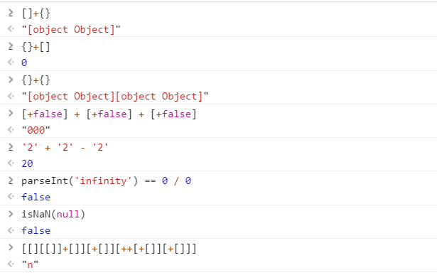

# 本仓库用来存放我看过的认为比较好的文章以及好句精选---根据时间排序
若想看根据分类排序 [good-articlles-by-sort](https://github.com/zhang0peter/good-articlles-by-sort)

## 2018-6
*   [中国拒绝“洋垃圾”对美国垃圾回收意味着什么？](http://www.qdaily.com/articles/53795.html)
*   [EF之Code First代码优先](https://blog.csdn.net/u011872945/article/details/72955908)
*   [我的面经，渗透测试](http://www.lofter.com/lpost/1f350fa3_125b03d2)
*   [举头三尺有铁拳](https://www.huxiu.com/article/246308.html)
*   [WebSocket在ASP.NET MVC4中的简单实现 ](https://www.cnblogs.com/zxtceq/p/7278454.html)
*   [从Chrome源码看WebSocket](https://www.yinchengli.com/2018/05/27/chrome-websocket)
*   [一文读懂 WebSocket 通信过程与实现 ](https://mp.weixin.qq.com/s?__biz=MzA3OTgyMDcwNg==&mid=2650635184&idx=2&sn=e58e831b9f51feabe80152476c1cc2cf)
*   [数据安全及各种加密算法对比](http://www.cocoachina.com/programmer/20180530/23572.html)
*   [实战Teensy烧录渗透测试U盘](http://www.freebuf.com/sectool/150367.html)
*   [被长期忽视、却危害巨大的邮件追踪术](http://36kr.com/p/5136373.html)
*   据称有**一千万**的阅读量 [《程序员技术练级攻略》](https://coolshell.cn/articles/4990.html)
*   [QT入门安装篇+helloworld(辛酸血泪)](https://blog.csdn.net/qq_37059483/article/details/77800592)
*   [一文简述多种无监督聚类算法的Python实现](http://zhuanlan.51cto.com/art/201805/574750.htm)

## 2018-5
*   [Python 中的元编程](https://www.ibm.com/developerworks/cn/analytics/library/ba-metaprogramming-python/index.html?ca=drs-)
*   [《我的职业是前端工程师》 - Ebook：I'm a FrontEnd Developer ](https://github.com/phodal/fe)
*   [36氪领读 | 史学经典，看瘟疫如何塑造人类历史与社会](http://36kr.com/p/5135719.html)
*   [深入理解C++ new/delete, new []/delete[]动态内存管理](http://www.cnblogs.com/tp-16b/p/8684298.html)
*   [毕业论文文献综述撰写模板](https://zhuanlan.zhihu.com/p/31682742)
*   [The Meaning of OP in Online Conversation](https://www.lifewire.com/what-does-o-p-stand-for-2483372)
*   [在 Bilibili 学技能涨知识，我推荐这 14 个频道](https://sspai.com/post/44652)
*   [Docker底层技术](https://www.jianshu.com/p/7a1ce51a0eba)
*   [非对称加密和证书总结](https://tlanyan.me/asymmetric-encryption-and-certificate-summary/)
*   [HTTPS 原理详解](http://liuduo.me/2018/05/14/https-detail/)
*   [正视历史，接受批评，是人类得以进步的原因 | 我们如何与未来相处⑤](http://www.qdaily.com/articles/52682.html)
*   [Docker：一场令人追悔莫及的豪赌](http://dockone.io/article/5520)
*   [IT“民科”罗永浩](https://www.huxiu.com/article/244293.html)  
罗永浩的“非正式同行”郭德纲曾经说过这么一段话：“内行要是与外行去辩论那是外行。
比如我和火箭科学家说，你那火箭不行，燃料不好，我认为得烧柴，最好是煤，煤最好选精煤，水洗煤不好。
如果那个科学家拿正眼看我一眼，那他就输了。”  
*   [被冤枉、被带节奏！你联想明明投票给了华为为何还说不清？](https://zhuanlan.zhihu.com/p/36910391)
*   [JavaScript 新手的踩坑日记](http://www.cocoachina.com/ios/20170619/19573.html)
*   [JavaScript || 对象](https://segmentfault.com/a/1190000008521798)
*   [JavaScript 奇怪事件簿](https://zhuanlan.zhihu.com/p/33986820)  
  
*   [常见的JavaScript内存泄露](https://github.com/zhansingsong/js-leakage-patterns)
*   [Cache为什么有那么多级？为什么一级比一级大？是不是Cache越大越好？](https://zhuanlan.zhihu.com/p/32058808)
*   [Cache是怎么组织和工作的？什么是n-ways Set-Associative Cache?](https://zhuanlan.zhihu.com/p/31859105)
*   [骗局揭秘：醒醒吧韭菜！有图未必有真相](https://zhuanlan.zhihu.com/p/36438458)
*   [聊聊机器学习中的那些树](https://www.tuicool.com/articles/7ZFrU3B)
*   [Deep Learning读书笔记（6）--【卷积神经网络】](https://www.tuicool.com/articles/i2QNfiZ)
*   [简述表征句子的3种无监督深度学习方法](https://www.tuicool.com/articles/n6jQRb2)
*   [聊聊机器学习中的那些树](https://www.tuicool.com/articles/7ZFrU3B)
*   [从无监督构建词库看「最小熵原理」，套路是如何炼成的](https://www.tuicool.com/articles/mIRjMnf)
*   [聊聊机器学习中的那些树](https://www.tuicool.com/articles/7ZFrU3B)

